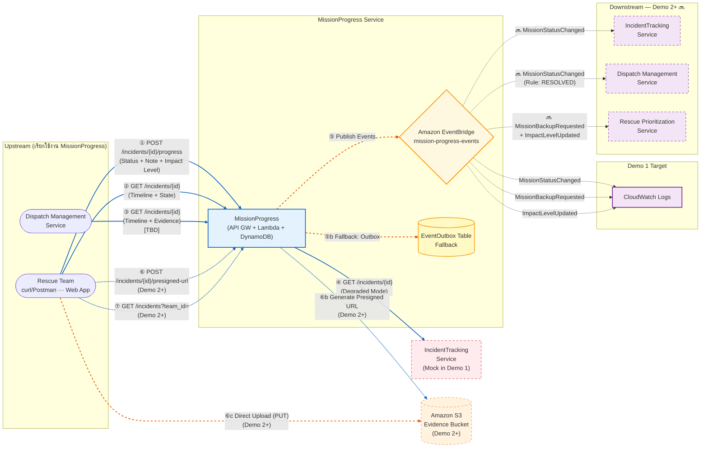

# ภาพรวมของบริการ (Service Overview)

# MissionProgress Service

## Quick Navigation

1. [ภาพรวมของบริการ (Service Overview)](#ภาพรวมของบริการ-service-overview)
2. [Synchronous Function Contract](#synchronous-function-contract)
3. [Asynchronous Function Contract](#asynchronous-function-contract)
4. [Service Data](#service-data)
5. [Service Architecture](#service-architecture)
6. [Service Interaction Diagram](#service-interaction-diagram)
7. [Dependency Mapping](#dependency-mapping)

---

## 1. Service Owner

| รายละเอียด       | ค่า                                              |
| :--------------- | :----------------------------------------------- |
| **ชื่อ**         | นายรัฐธรรมนูญ โคสาแสง (Ratthatummanoon Kosasang) |
| **รหัสนักศึกษา** | 6609612178                                       |

---

## 2. Service Purpose

MissionProgress Service คือบริการสำหรับทีมกู้ภัย (Rescue Team) เพื่อใช้ในการรายงานความคืบหน้าของภารกิจที่ได้รับมอบหมาย อัปเดตสถานะของเหตุการณ์ (Incident Status) และบันทึกรายละเอียดการปฏิบัติงานหน้างาน (Action Logs) เพื่อให้ศูนย์สั่งการได้รับข้อมูลที่ถูกต้องและเป็นปัจจุบันที่สุด

---

## 3. Pain Point ที่แก้ไข

ปัจจุบันศูนย์สั่งการ (Command Center) ขาดการมองเห็นภาพรวมและการติดตามสถานะการทำงานของทีมกู้ภัยแบบเรียลไทม์ (Lack of real-time visibility) รวมถึงขาดข้อมูลประเมินความรุนแรง (Impact Assessment) ที่ถูกต้องแม่นยำจากหน้างานจริง ทำให้การตัดสินใจสั่งการหรือสนับสนุนทรัพยากรเกิดความล่าช้าและผิดพลาด

---

## 4. Target Users

| ผู้ใช้งาน                       | บทบาท                                                                 |
| :------------------------------ | :-------------------------------------------------------------------- |
| **Rescue Team** (ผู้ใช้งานหลัก) | ใช้สำหรับอัปเดตสถานะ แจ้งพิกัดเมื่อถึงหน้างาน และประเมินความรุนแรง    |
| **Dispatcher**                  | ใช้ดูข้อมูล Timeline การทำงานเพื่อติดตามผล (ผ่านการดึงข้อมูลไปแสดงผล) |

---

## 5. Service Boundary

### ✅ In-scope Responsibilities (สิ่งที่บริการนี้รับผิดชอบ)

| ความรับผิดชอบ                       | รายละเอียด                                                                                                                                                             |
| :---------------------------------- | :--------------------------------------------------------------------------------------------------------------------------------------------------------------------- |
| **State Transition Management**     | รับผิดชอบการเปลี่ยนสถานะภารกิจตาม Workflow: `DISPATCHED` → `EN_ROUTE` → `ON_SITE` → `NEED_BACKUP` → `RESOLVED` พร้อม Validate ว่าการเปลี่ยนสถานะสมเหตุสมผล             |
| **Timeline / Action Log Recording** | บันทึก Log การปฏิบัติงานทุกรายการ เช่น เวลาที่ถึงจุดเกิดเหตุ, การกระทำ (Evacuation start, First aid applied), ผู้กระทำ                                                 |
| **Field Assessment Forwarding**     | รับข้อมูลประเมิน Impact Level / Priority จากทีมกู้ภัยหน้างาน บันทึกเป็น Action Log แล้ว Publish Event ไปยัง IncidentTracking (ผู้เป็นเจ้าของข้อมูล) เพื่ออัปเดตค่าจริง |
| **Evidence Image Management**       | รับและจัดเก็บหลักฐานภาพถ่ายจากหน้างาน (Evidence Images) ผ่าน S3 Presigned URL พร้อมเชื่อม Image Key กับ Timeline                                                       |
| **Event Publishing**                | Publish Domain Events (`MissionStatusChangedEvent`, `FieldAssessmentUpdatedEvent`) ไปยัง SNS เพื่อแจ้ง Service อื่นๆ                                                   |

### ❌ Out-of-scope / Not Responsible For (ไม่รับผิดชอบ)

| สิ่งที่ไม่รับผิดชอบ                                            | บริการที่รับผิดชอบ                                            |
| :------------------------------------------------------------- | :------------------------------------------------------------ |
| การ "สั่งการ" หรือ "มอบหมายงาน" ให้ทีมกู้ภัย                   | Manage Dispatch Service                                       |
| การค้นหาเส้นทาง                                                | SafeRoute Service                                             |
| การจัดการทรัพยากรโรงพยาบาล / การส่งตัวผู้ป่วย                  | HospitalResourceStatus Service                                |
| การเป็น Source of Truth ของ Impact Level / Priority / Location | IncidentTracking Service (MissionProgress แค่ Forward ข้อมูล) |

---

## 6. Autonomy / Decision Logic

บริการมีความเป็นอิสระในการตัดสินใจเกี่ยวกับ:

### 1. Status Validation (การตรวจสอบสถานะ)

- ตรวจสอบว่าการเปลี่ยนสถานะสมเหตุสมผลหรือไม่ตามตาราง State Transition ที่กำหนด
- เช่น ต้องเป็น `ON_SITE` ก่อนจึงจะ `RESOLVED` ได้
- `NEED_BACKUP` จะ Trigger การ Publish Event เพื่อแจ้งเตือน

### 2. Field Assessment Acceptance (การรับข้อมูลจากหน้างาน)

- รับข้อมูล Impact Level / Priority ที่ทีมกู้ภัยปรับจากหน้างาน ได้ทันที โดยไม่ต้องรอการอนุมัติ
- บันทึกลง Timeline เป็น Action Log พร้อม Forward ผ่าน Event ให้ IncidentTracking อัปเดต

### 3. Idempotency Decision (การตัดสินใจเรื่อง Duplicate)

- ตรวจสอบ Idempotency Key ว่า Request นี้เคยถูกประมวลผลแล้วหรือยัง
- ถ้าเคย → Return cached response ทันทีโดยไม่ประมวลผลซ้ำ

### การตัดสินใจอิงจาก

| แหล่งข้อมูล               | รายละเอียด                |
| :------------------------ | :------------------------ |
| Input จากทีมกู้ภัยหน้างาน | User Action               |
| สถานะปัจจุบันของภารกิจ    | Current State ใน DynamoDB |
| Idempotency Records       | ใน DynamoDB               |

> _บริการตัดสินใจได้เองภายใต้ Business Rules ที่กำหนด โดยไม่ต้องรอการอนุมัติจากมนุษย์ในกรณีปกติ_

---

## 7. Owned Data

> ข้อมูลที่บริการนี้เป็นเจ้าของและดูแลโดยตรง (Source of Truth)

| ข้อมูล                             | รายละเอียด                                                                                        |
| :--------------------------------- | :------------------------------------------------------------------------------------------------ |
| **Mission Timeline / Action Logs** | ข้อมูลประวัติการทำงานทั้งหมดที่เป็น Array of objects (เก็บ เวลา, เหตุการณ์, รายละเอียด, ผู้กระทำ) |
| **Operational Context Updates**    | ข้อมูลบริบทหน้างานล่าสุดที่ทีมกู้ภัยส่งมา เช่น last_update_at, updated_by (Rescue Unit ID)        |

---

## 8. Linked Data (Reference Only)

> ข้อมูลที่บริการนี้ต้องอ้างอิงจากบริการอื่น แต่ไม่ได้เป็นเจ้าของหลัก

| ข้อมูล                   | แหล่งอ้างอิง                                           | วัตถุประสงค์                                                                       |
| :----------------------- | :----------------------------------------------------- | :--------------------------------------------------------------------------------- |
| **Incident Master Data** | _IncidentTracking Service_ (หรือ Core Incident Schema) | อ้างอิง incident_id, incident_type, incident_description เพื่อแสดงผลให้ทีมกู้ภัยดู |
| **Rescue Team Info**     | ระบบจัดการทีม                                          | อ้างอิง ID ของทีมกู้ภัย เพื่อระบุว่าใครเป็นคนส่ง Log                               |

---

## 9. Non-Functional Requirements

| NFR                           | รายละเอียด                                                        | สอดคล้องกับ Architecture อย่างไร                                                                                                                                                                                                                                              |
| :---------------------------- | :---------------------------------------------------------------- | :---------------------------------------------------------------------------------------------------------------------------------------------------------------------------------------------------------------------------------------------------------------------------- |
| **High Availability (99.9%)** | ระบบต้องพร้อมใช้งาน 24/7 หยุดชะงักไม่ได้                          | Lambda + DynamoDB + S3 + SNS + SQS ทั้งหมดเป็น AWS Managed Services มี built-in HA หลาย AZ                                                                                                                                                                                    |
| **Low Latency (<500ms)**      | Update Status และ Read Timeline ต้องตอบสนอง <500ms                | Go Lambda cold start \~80-150ms, DynamoDB single-digit ms, API GW \~10-20ms → รวม \~100-200ms ปกติ                                                                                                                                                                            |
| **Concurrent Handling**       | รองรับหลายร้อยทีมพร้อมกันในช่วงวิกฤต                              | Lambda auto-scales (concurrent executions), DynamoDB On-Demand auto-scales (no capacity planning)                                                                                                                                                                             |
| **Data Integrity**            | Timeline ต้องเรียงลำดับเวลาถูกต้อง (Sequential Consistency)       | DynamoDB Sort Key ใช้ ISO 8601 timestamp → Query ด้วย ScanIndexForward=true ได้เรียงตามเวลา                                                                                                                                                                                   |
| **Resilience & Idempotency**  | รองรับ Network หลุดชั่วคราว, Client Retry ได้โดยไม่เกิด Duplicate | Client-side: เก็บ Pending Actions ใน localStorage, Retry ด้วย Idempotency Key เดิม — Server-side: Lambda ตรวจสอบ Idempotency Key ใน DynamoDB ด้วย `attribute_not_exists(PK)` Condition → ป้องกัน Duplicate แบบ Atomic — Event-level: SNS Delivery Failure → DLQ → Retry later |
| **Data Durability**           | ข้อมูลต้องไม่สูญหาย                                               | DynamoDB 99.99% durability, S3 99.99% durability, SNS + DLQ ป้องกัน Event loss                                                                                                                                                                                                |

---

# Synchronous Function Contract

> **Base URL:** `https://api.disaster-management.net/mission-progress/v1`

---

# API Contract #1: Report Progress & Update Status

## ข้อมูลทั่วไป

| รายการ     | ค่า                                 |
| :--------- | :---------------------------------- |
| **Name**   | `reportMissionProgress`             |
| **Method** | `POST`                              |
| **Path**   | `/incidents/{incident_id}/progress` |
| **Type**   | Synchronous                         |
| **Lambda** | `report-progress` (Go)              |

## คำอธิบาย

ใช้สำหรับทีมกู้ภัยเพื่อ "บันทึกการปฏิบัติงาน" (Create new Timeline entry) และ "อัปเดตสถานะ" (Update mission status) ของภารกิจในครั้งเดียว เช่น แจ้งว่าถึงจุดเกิดเหตุแล้ว, ขอกำลังเสริม, หรือแจ้งปิดงาน พร้อมทั้ง Publish Events ไป EventBridge เพื่อแจ้ง Service อื่นๆ

---

## Request

### Path Parameters

| Parameter     | Type   | Required | คำอธิบาย                                            |
| :------------ | :----- | :------: | :-------------------------------------------------- |
| `incident_id` | String |    ✅    | รหัสเหตุการณ์ที่กำลังปฏิบัติภารกิจ (เช่น `INC-001`) |

### Headers

| Header             | Required | คำอธิบาย                                      |
| :----------------- | :------: | :-------------------------------------------- |
| `Content-Type`     |    ✅    | `application/json`                            |
| `x-api-key`        |    ✅    | API Key สำหรับ Authentication                 |
| `X-Rescue-Team-ID` |    ✅    | รหัสทีมกู้ภัยที่ส่งข้อมูล (เช่น `TEAM-ALPHA`) |

### Body

```json
{
  "new_status": "ON_SITE",
  "note": "ถึงจุดเกิดเหตุแล้ว กำลังเริ่มปฐมพยาบาลเบื้องต้น",
  "new_impact_level": "HIGH"
}
```

| Field              | Type          | Required | คำอธิบาย                                                                     |
| :----------------- | :------------ | :------: | :--------------------------------------------------------------------------- |
| `new_status`       | String (Enum) |    ✅    | สถานะใหม่: `EN_ROUTE`, `ON_SITE`, `NEED_BACKUP`, `RESOLVED`                  |
| `note`             | String        |    ❌    | รายละเอียดการปฏิบัติงาน / หมายเหตุ                                           |
| `new_impact_level` | String        |    ❌    | ระดับความรุนแรงใหม่จากการประเมินหน้างาน → publish `ImpactLevelUpdated` event |

---

## Response

### Success `200 OK`

```json
{
  "message": "Progress reported successfully",
  "mission_id": "MSN-001",
  "incident_id": "INC-001",
  "old_status": "EN_ROUTE",
  "new_status": "ON_SITE",
  "updated_at": "2025-06-14T09:32:15Z"
}
```

### Error `400 Bad Request` — State Transition ผิดกฎ

```json
{
  "error": "INVALID_STATE_TRANSITION",
  "code": "INVALID_STATE_TRANSITION",
  "message": "Cannot transition from EN_ROUTE to RESOLVED"
}
```

### Error `400 Bad Request` — ไม่ส่ง new_status

```json
{
  "error": "MISSING_PARAMETER",
  "code": "MISSING_PARAMETER",
  "message": "new_status is required"
}
```

### Error `400 Bad Request` — สถานะไม่รู้จัก

```json
{
  "error": "INVALID_STATUS",
  "code": "INVALID_STATUS",
  "message": "Invalid status value: UNKNOWN_STATUS"
}
```

### Error `400 Bad Request` — JSON body ไม่ถูกต้อง

```json
{
  "error": "INVALID_BODY",
  "code": "INVALID_BODY",
  "message": "Invalid request body"
}
```

### Error `404 Not Found` — ไม่พบ incident_id

```json
{
  "error": "INCIDENT_NOT_FOUND",
  "code": "INCIDENT_NOT_FOUND",
  "message": "No mission found for incident: INC-99999"
}
```

### Error `403 Forbidden` — Auth ไม่ผ่าน

```json
{
  "message": "Forbidden"
}
```

---

## State Machine (Validation Rules)

```
DISPATCHED ──→ EN_ROUTE ──→ ON_SITE ──→ RESOLVED
                                │
                                ▼
                          NEED_BACKUP ──→ RESOLVED
                                │
                                └──→ ON_SITE
```

| จาก           | ไปได้                     | ไปไม่ได้                     |
| :------------ | :------------------------ | :--------------------------- |
| `DISPATCHED`  | `EN_ROUTE`                | ❌ ข้ามขั้นตอนไม่ได้         |
| `EN_ROUTE`    | `ON_SITE`                 | ❌ `RESOLVED`, `NEED_BACKUP` |
| `ON_SITE`     | `NEED_BACKUP`, `RESOLVED` | ❌ `EN_ROUTE`, `DISPATCHED`  |
| `NEED_BACKUP` | `ON_SITE`, `RESOLVED`     | ❌ `EN_ROUTE`, `DISPATCHED`  |
| `RESOLVED`    | ❌ (Final State)          | ❌ ทุกสถานะ                  |

---

## Dependency / Reliability

| ประเภท                    | รายละเอียด                                                                                                                                                |
| :------------------------ | :-------------------------------------------------------------------------------------------------------------------------------------------------------- |
| **Internal Data (Write)** | อัปเดต MissionAssignment table (`current_status`, `last_updated_at`) + Insert entry ใน MissionTimeline table                                              |
| **EventBridge (Async)**   | Publish สูงสุด 3 Events: `MissionStatusChanged` (ทุกครั้ง), `MissionBackupRequested` (ถ้า `NEED_BACKUP`), `ImpactLevelUpdated` (ถ้ามี `new_impact_level`) |
| **Outbox Fallback**       | หาก EventBridge Publish ล้มเหลว → บันทึกลง EventOutbox table → POST request ไม่ fail (ข้อมูลสถานะ safe ใน DynamoDB แล้ว)                                  |
| **Validation**            | ตรวจสอบ State Transition ตาม Business Rules ก่อนบันทึก — reject ถ้าไม่ถูกกฎ                                                                               |

---

---

# API Contract #2: View Incident Mission Details

> _(Action B: ดูข้อมูลเหตุการณ์)_

## ข้อมูลทั่วไป

| รายการ     | ค่า                        |
| :--------- | :------------------------- |
| **Name**   | `getMissionDetails`        |
| **Method** | `GET`                      |
| **Path**   | `/incidents/{incident_id}` |
| **Type**   | Synchronous                |
| **Lambda** | `get-mission` (Go)         |
| **Demo 1** | ✅ Implemented             |

## คำอธิบาย

ใช้ดึงข้อมูลรายละเอียดของภารกิจ รวมถึง "ประวัติการทำงานทั้งหมด (Timeline)" และ "ข้อมูลเหตุการณ์จาก IncidentTracking Service" (Degraded Mode เมื่อเรียกไม่สำเร็จ) เพื่อให้ทีมกู้ภัยดูย้อนหลังหรือ Dispatcher ตรวจสอบความคืบหน้า

---

## Request

### Path Parameters

| Parameter     | Type   | Required | คำอธิบาย                                   |
| :------------ | :----- | :------: | :----------------------------------------- |
| `incident_id` | String |    ✅    | รหัสเหตุการณ์ที่ต้องการดู (เช่น `INC-001`) |

### Headers

| Header             | Required | คำอธิบาย                      |
| :----------------- | :------: | :---------------------------- |
| `x-api-key`        |    ✅    | API Key สำหรับ Authentication |
| `X-Rescue-Team-ID` |    ✅    | รหัสทีมกู้ภัย                 |

### Body

> ไม่มี

---

## Response

### Success `200 OK` — Degraded Mode (Demo 1 เสมอ)

```json
{
  "incident_id": "INC-001",
  "mission_id": "MSN-001",
  "rescue_team_id": "TEAM-ALPHA",
  "current_status": "ON_SITE",
  "latest_impact_level": 3,
  "started_at": "2024-12-01T08:00:00Z",
  "last_updated_at": "2025-06-14T09:32:15Z",
  "timeline": [
    {
      "mission_id": "MSN-001",
      "timestamp": "2024-12-01T08:00:00Z",
      "log_id": "LOG-001",
      "action_type": "STATUS_CHANGE",
      "description": "Mission dispatched to TEAM-ALPHA",
      "performed_by": "SYSTEM"
    },
    {
      "mission_id": "MSN-001",
      "timestamp": "2025-06-14T09:32:15Z",
      "log_id": "LOG-002",
      "action_type": "STATUS_CHANGE",
      "description": "ถึงจุดเกิดเหตุแล้ว",
      "old_status": "EN_ROUTE",
      "new_status": "ON_SITE",
      "performed_by": "TEAM-ALPHA"
    }
  ],
  "data_source": "partial"
}
```

### Success `200 OK` — Full Mode (Demo 2+ เมื่อ IncidentTracking พร้อม)

```json
{
  "incident_id": "INC-001",
  "mission_id": "MSN-001",
  "rescue_team_id": "TEAM-ALPHA",
  "current_status": "ON_SITE",
  "latest_impact_level": 3,
  "started_at": "2024-12-01T08:00:00Z",
  "last_updated_at": "2025-06-14T09:32:15Z",
  "description": "น้ำท่วมหนักบริเวณถนนพหลโยธิน",
  "location": "13.7563,100.5018",
  "incident_type": "FLOOD",
  "timeline": [ ... ],
  "data_source": "full"
}
```

### Field Availability by Mode

| Field                                         | มี Degraded? | มี Full? | Source                   |
| :-------------------------------------------- | :----------: | :------: | :----------------------- |
| `incident_id`, `mission_id`, `rescue_team_id` |      ✅      |    ✅    | MissionAssignment table  |
| `current_status`, `latest_impact_level`       |      ✅      |    ✅    | MissionAssignment table  |
| `started_at`, `last_updated_at`               |      ✅      |    ✅    | MissionAssignment table  |
| `timeline`                                    |      ✅      |    ✅    | MissionTimeline table    |
| `description`, `location`, `incident_type`    |      ❌      |    ✅    | IncidentTracking Service |
| `data_source`                                 | `"partial"`  | `"full"` | —                        |

### Error `404 Not Found`

```json
{
  "error": "INCIDENT_NOT_FOUND",
  "code": "INCIDENT_NOT_FOUND",
  "message": "No mission found for incident: INC-99999"
}
```

### Error `403 Forbidden`

```json
{
  "message": "Forbidden"
}
```

---

## Dependency / Reliability

| ประเภท                   | รายละเอียด                                                                                            |
| :----------------------- | :---------------------------------------------------------------------------------------------------- |
| **Internal Data (Read)** | อ่าน MissionAssignment table (state) + MissionTimeline table (timeline เรียงตาม timestamp)            |
| **External Dependency**  | HTTP GET → IncidentTracking Service เพื่อดึง description, location, incident_type (timeout: 3 วินาที) |
| **Degraded Mode**        | IncidentTracking ล่ม/timeout → ส่งข้อมูลเฉพาะที่มี → `data_source: "partial"`                         |

---

---

# API Contract #3: Request Presigned URL for Evidence Upload

## ข้อมูลทั่วไป

| รายการ     | ค่า                                      |
| :--------- | :--------------------------------------- |
| **Name**   | `requestEvidenceUploadURL`               |
| **Method** | `POST`                                   |
| **Path**   | `/incidents/{incident_id}/presigned-url` |
| **Type**   | Synchronous                              |
| **Lambda** | `presigned-url` (Go)                     |

## คำอธิบาย

ใช้สำหรับทีมกู้ภัยเพื่อ "ขอ Presigned URL" จากระบบ ก่อนอัปโหลดรูปภาพหลักฐานจากหน้างาน (Evidence Image) ตรงไปยัง Amazon S3 โดยไม่ต้องส่งไฟล์ผ่าน Lambda (ลดภาระ Server + หลีกเลี่ยง Lambda payload limit 6MB)

---

## Flow การใช้งาน

```
1. Frontend เรียก POST /incidents/{id}/presigned-url → ส่ง file_name + content_type
2. Lambda สร้าง Presigned URL (PUT) อายุ 5 นาที → ส่งกลับ upload_url + image_key
3. Frontend ใช้ upload_url อัปโหลดไฟล์ตรงไป S3 (HTTP PUT)
4. Frontend ส่ง image_key ไปพร้อม POST /incidents/{id}/progress (เพื่อเชื่อม Evidence กับ Timeline entry)
```

---

## Request

### Path Parameters

| Parameter     | Type   | Required | คำอธิบาย                                                  |
| :------------ | :----- | :------: | :-------------------------------------------------------- |
| `incident_id` | String |    ✅    | รหัสเหตุการณ์ที่ต้องการอัปโหลดรูปหลักฐาน (เช่น `INC-001`) |

### Headers

| Header             | Required | คำอธิบาย                                      |
| :----------------- | :------: | :-------------------------------------------- |
| `Content-Type`     |    ✅    | `application/json`                            |
| `x-api-key`        |    ✅    | API Key สำหรับ Authentication                 |
| `X-Rescue-Team-ID` |    ✅    | รหัสทีมกู้ภัยที่ส่งข้อมูล (เช่น `TEAM-ALPHA`) |

### Body

```json
{
  "file_name": "flood-evidence-001.jpg",
  "content_type": "image/jpeg"
}
```

| Field          | Type   | Required | คำอธิบาย                                           |
| :------------- | :----- | :------: | :------------------------------------------------- |
| `file_name`    | String |    ✅    | ชื่อไฟล์ที่ต้องการอัปโหลด (เช่น `photo-001.jpg`)   |
| `content_type` | String |    ✅    | MIME type ของไฟล์ (เช่น `image/jpeg`, `image/png`) |

---

## Response

### Success `200 OK`

```json
{
  "upload_url": "https://s3.amazonaws.com/mission-evidence-bucket/evidence/INC-001/TEAM-ALPHA/1718352735-flood-evidence-001.jpg?X-Amz-Algorithm=AWS4-HMAC-SHA256&...",
  "image_key": "evidence/INC-001/TEAM-ALPHA/1718352735-flood-evidence-001.jpg",
  "expires_in": 300,
  "message": "Presigned URL generated successfully"
}
```

| Field        | Type    | คำอธิบาย                                                              |
| :----------- | :------ | :-------------------------------------------------------------------- |
| `upload_url` | String  | Presigned URL สำหรับ HTTP PUT อัปโหลดไฟล์ตรงไป S3                     |
| `image_key`  | String  | S3 Key ของไฟล์ — ใช้แนบไปกับ `POST /progress` เพื่อเชื่อมกับ Timeline |
| `expires_in` | Integer | อายุของ URL เป็นวินาที (300 = 5 นาที)                                 |
| `message`    | String  | ข้อความยืนยัน                                                         |

### S3 Key Format

```
evidence/{incident_id}/{team_id}/{unix_timestamp}-{file_name}
```

> ตัวอย่าง: `evidence/INC-001/TEAM-ALPHA/1718352735-flood-evidence-001.jpg`
>
> ใช้ `{unix_timestamp}` เพื่อป้องกันชื่อไฟล์ซ้ำ

### Error `400 Bad Request` — ไม่ส่ง field ที่จำเป็น

```json
{
  "error": "MISSING_PARAMETER",
  "code": "MISSING_PARAMETER",
  "message": "file_name and content_type are required"
}
```

### Error `400 Bad Request` — content_type ไม่รองรับ

```json
{
  "error": "INVALID_CONTENT_TYPE",
  "code": "INVALID_CONTENT_TYPE",
  "message": "Supported content types: image/jpeg, image/png, image/webp"
}
```

### Error `404 Not Found` — ไม่พบ incident_id

```json
{
  "error": "INCIDENT_NOT_FOUND",
  "code": "INCIDENT_NOT_FOUND",
  "message": "No mission found for incident: INC-99999"
}
```

### Error `403 Forbidden`

```json
{
  "message": "Forbidden"
}
```

---

## Frontend Upload Flow (หลังได้ Presigned URL)

```bash
# Frontend ใช้ upload_url ที่ได้มา อัปโหลดไฟล์ตรงไป S3
curl -X PUT \
  -H "Content-Type: image/jpeg" \
  --data-binary @flood-evidence-001.jpg \
  "https://s3.amazonaws.com/mission-evidence-bucket/evidence/INC-001/...?X-Amz-Algorithm=..."

# HTTP 200 = อัปโหลดสำเร็จ

# จากนั้นส่ง image_key ไปพร้อม POST /progress
curl -X POST \
  -H "x-api-key: $API_KEY" \
  -H "X-Rescue-Team-ID: TEAM-ALPHA" \
  -H "Content-Type: application/json" \
  -d '{
    "new_status": "ON_SITE",
    "note": "ถึงจุดเกิดเหตุ น้ำสูง 1.2m",
    "image_key": "evidence/INC-001/TEAM-ALPHA/1718352735-flood-evidence-001.jpg"
  }' \
  "$API_URL/incidents/INC-001/progress"
```

---

## Dependency / Reliability

| ประเภท                   | รายละเอียด                                                                                   |
| :----------------------- | :------------------------------------------------------------------------------------------- |
| **Internal Data (Read)** | ตรวจสอบว่า incident_id มี Mission อยู่ใน MissionAssignment table                             |
| **AWS S3**               | สร้าง Presigned URL (PUT) ด้วย AWS SDK — ไม่ได้ upload ไฟล์จริงใน step นี้                   |
| **Validation**           | ตรวจสอบ file_name ไม่ว่าง, content_type เป็นรูปภาพที่รองรับ (`jpeg`/`png`/`webp`)            |
| **Security**             | Presigned URL อายุ 5 นาที → หมดอายุแล้วใช้ไม่ได้ ต้องขอใหม่                                  |
| **Upload Failure**       | ถ้า Frontend อัปโหลดไป S3 ไม่สำเร็จ → อนุญาตให้ "ข้าม" (Skip) → ส่งเฉพาะ Text Status ก่อนได้ |

---

---

# API Contract #4: List Team Missions

## ข้อมูลทั่วไป

| รายการ     | ค่า                                                               |
| :--------- | :---------------------------------------------------------------- |
| **Name**   | `listTeamMissions`                                                |
| **Method** | `GET`                                                             |
| **Path**   | `/incidents`                                                      |
| **Type**   | Synchronous                                                       |
| **Lambda** | `get-mission` (Go) — เพิ่ม handler path ใหม่ หรือ แยก Lambda ใหม่ |

## คำอธิบาย

ใช้ดึง รายการภารกิจทั้งหมด ของทีมกู้ภัยที่ระบุ เพื่อให้ทีมกู้ภัยเห็นภาพรวมว่าตัวเองมีกี่ภารกิจ แต่ละภารกิจอยู่สถานะอะไร → กดเข้าไปดู Timeline ละเอียดด้วย `GET /incidents/{incident_id}` ต่อได้

## Use Cases

- ทีมกู้ภัยเปิดแอปมา → เห็นรายการภารกิจทั้งหมดของตัวเอง
- Dispatcher ดูว่าทีมหนึ่งๆ รับผิดชอบภารกิจอะไรบ้าง
- กรอง Active missions (ยังไม่ `RESOLVED`) เพื่อโฟกัสงานที่ต้องทำ

---

## Request

### Query Parameters

| Parameter | Type   | Required | คำอธิบาย                                                               |
| :-------- | :----- | :------: | :--------------------------------------------------------------------- |
| `team_id` | String |    ✅    | รหัสทีมกู้ภัย (เช่น `TEAM-ALPHA`)                                      |
| `status`  | String |    ❌    | กรองเฉพาะสถานะ (เช่น `ON_SITE`, `NEED_BACKUP`) ถ้าไม่ส่ง = ดึงทุกสถานะ |

### Headers

| Header             | Required | คำอธิบาย                      |
| :----------------- | :------: | :---------------------------- |
| `x-api-key`        |    ✅    | API Key สำหรับ Authentication |
| `X-Rescue-Team-ID` |    ✅    | รหัสทีมกู้ภัย                 |

### Body

> ไม่มี

### ตัวอย่าง Request

```bash
# ดึงภารกิจทั้งหมดของ TEAM-ALPHA
curl -s -H "x-api-key: $API_KEY" \
  -H "X-Rescue-Team-ID: TEAM-ALPHA" \
  "$API_URL/incidents?team_id=TEAM-ALPHA" | jq .

# ดึงเฉพาะภารกิจที่สถานะ ON_SITE
curl -s -H "x-api-key: $API_KEY" \
  -H "X-Rescue-Team-ID: TEAM-ALPHA" \
  "$API_URL/incidents?team_id=TEAM-ALPHA&status=ON_SITE" | jq .
```

---

## Response

### Success `200 OK`

```json
{
  "team_id": "TEAM-ALPHA",
  "total_missions": 3,
  "missions": [
    {
      "mission_id": "MSN-001",
      "incident_id": "INC-001",
      "current_status": "ON_SITE",
      "latest_impact_level": 3,
      "started_at": "2024-12-01T08:00:00Z",
      "last_updated_at": "2025-06-14T09:32:15Z"
    },
    {
      "mission_id": "MSN-003",
      "incident_id": "INC-003",
      "current_status": "NEED_BACKUP",
      "latest_impact_level": 5,
      "started_at": "2025-06-14T07:00:00Z",
      "last_updated_at": "2025-06-14T10:15:00Z"
    },
    {
      "mission_id": "MSN-005",
      "incident_id": "INC-005",
      "current_status": "RESOLVED",
      "latest_impact_level": 2,
      "started_at": "2025-06-13T14:00:00Z",
      "last_updated_at": "2025-06-13T18:30:00Z"
    }
  ]
}
```

| Field                            | Type              | คำอธิบาย                            |
| :------------------------------- | :---------------- | :---------------------------------- |
| `team_id`                        | String            | รหัสทีมกู้ภัยที่ค้นหา               |
| `total_missions`                 | Integer           | จำนวนภารกิจทั้งหมดที่พบ             |
| `missions`                       | Array             | รายการภารกิจ (สรุป ไม่รวม Timeline) |
| `missions[].mission_id`          | String            | รหัสภารกิจ                          |
| `missions[].incident_id`         | String            | รหัสเหตุการณ์                       |
| `missions[].current_status`      | String            | สถานะปัจจุบัน                       |
| `missions[].latest_impact_level` | Integer           | ระดับความรุนแรงล่าสุด               |
| `missions[].started_at`          | String (ISO 8601) | เวลาเริ่มภารกิจ                     |
| `missions[].last_updated_at`     | String (ISO 8601) | เวลาอัปเดตล่าสุด                    |

### Success `200 OK` — ไม่พบภารกิจ

```json
{
  "team_id": "TEAM-UNKNOWN",
  "total_missions": 0,
  "missions": []
}
```

### Success `200 OK` — กรองด้วย status

```json
{
  "team_id": "TEAM-ALPHA",
  "total_missions": 1,
  "missions": [
    {
      "mission_id": "MSN-001",
      "incident_id": "INC-001",
      "current_status": "ON_SITE",
      "latest_impact_level": 3,
      "started_at": "2024-12-01T08:00:00Z",
      "last_updated_at": "2025-06-14T09:32:15Z"
    }
  ]
}
```

### Error `400 Bad Request` — ไม่ส่ง team_id

```json
{
  "error": "MISSING_PARAMETER",
  "code": "MISSING_PARAMETER",
  "message": "team_id query parameter is required"
}
```

### Error `400 Bad Request` — status ไม่ถูกต้อง

```json
{
  "error": "INVALID_STATUS",
  "code": "INVALID_STATUS",
  "message": "Invalid status filter: UNKNOWN_STATUS. Valid values: DISPATCHED, EN_ROUTE, ON_SITE, NEED_BACKUP, RESOLVED"
}
```

### Error `403 Forbidden`

```json
{
  "message": "Forbidden"
}
```

---

## DynamoDB Query Strategy

ใช้ GSI `team-index` ของ MissionAssignment table:

```
GSI: team-index
  Partition Key: rescue_team_id = "TEAM-ALPHA"

→ ได้ภารกิจทั้งหมดของทีม

ถ้ามี status filter:
→ Filter Expression: current_status = :status
→ DynamoDB filter หลัง query (ไม่ใช่ Key Condition)
```

---

## Dependency / Reliability

| ประเภท                     | รายละเอียด                                                                             |
| :------------------------- | :------------------------------------------------------------------------------------- |
| **Internal Data (Read)**   | Query MissionAssignment table ผ่าน GSI `team-index` (Partition Key = `rescue_team_id`) |
| **No External Dependency** | ไม่เรียก Service อื่น — อ่านจาก DynamoDB ของตัวเองเท่านั้น                             |
| **Validation**             | ตรวจสอบ team_id ไม่ว่าง, status (ถ้ามี) เป็นค่าที่ถูกต้อง                              |
| **Performance**            | GSI query = single-digit ms / Filter Expression ทำที่ DynamoDB → ไม่กระทบ Lambda       |
| **Empty Result**           | ไม่พบภารกิจ → return `200 OK` พร้อม `missions: []` (ไม่ใช่ 404)                        |

---

# **Asynchronous Function Contract**

---

## **Message Contract #1: MissionStatusChanged**

### ข้อมูลทั่วไป

| Field             | Value                                                 |
| ----------------- | ----------------------------------------------------- |
| Message Name      | MissionStatusChangedEvent                             |
| Interaction Style | Asynchronous (Publish/Subscribe)                      |
| Producer          | MissionProgress Service (report-progress Lambda — Go) |
| Consumers         | IncidentTracking, Dispatch Management                 |
| Channel           | EventBridge (mission-progress-events)                 |
| Demo 1            | ✅ CloudWatch Logs                                    |
| Demo 2+           | 🔜 Route ไป Service จริง                              |

---

### คำอธิบาย

Event ถูก publish เมื่อมีการเปลี่ยนสถานะภารกิจสำเร็จ (ผ่าน validation)

**ใช้สำหรับ:**

- IncidentTracking → อัปเดตสถานะ Incident
- Dispatch → ปลดล็อกทีม (เฉพาะ `RESOLVED`)

**Trigger:** `POST /incidents/{id}/progress`

---

### Message Format

```json
{
  "source": "mission-progress-service",
  "detail-type": "MissionStatusChanged",
  "detail": {
    "mission_id": "MSN-001",
    "incident_id": "INC-001",
    "rescue_team_id": "TEAM-ALPHA",
    "old_status": "EN_ROUTE",
    "new_status": "ON_SITE",
    "note": "ถึงจุดเกิดเหตุแล้ว น้ำสูง 1.2m",
    "updated_at": "2025-06-14T09:32:15Z",
    "performed_by": "TEAM-ALPHA"
  }
}
```

---

### Field Definition

| Field                 | Type            | Required | Description              |
| --------------------- | --------------- | -------- | ------------------------ |
| source                | String          | ✅       | mission-progress-service |
| detail-type           | String          | ✅       | MissionStatusChanged     |
| detail.mission_id     | String          | ✅       | รหัสภารกิจ               |
| detail.incident_id    | String          | ✅       | รหัสเหตุการณ์            |
| detail.rescue_team_id | String          | ✅       | ทีมกู้ภัย                |
| detail.old_status     | String          | ✅       | สถานะเดิม                |
| detail.new_status     | String          | ✅       | สถานะใหม่                |
| detail.note           | String          | ❌       | หมายเหตุ                 |
| detail.updated_at     | ISO 8601 String | ✅       | เวลา                     |
| detail.performed_by   | String          | ✅       | ผู้กระทำ                 |

---

### Validation Rules

- `new_status` ต้องถูกต้องตาม State Machine
- `updated_at` ต้องเป็น ISO 8601
- `rescue_team_id` ห้ามว่าง

---

### Consumer Routing

| Consumer         | Rule Filter                        | Demo 1 | Demo 2+    |
| ---------------- | ---------------------------------- | ------ | ---------- |
| IncidentTracking | detail-type = MissionStatusChanged | Logs   | 🔜 Service |
| Dispatch         | + new_status = RESOLVED            | Logs   | 🔜 Service |

---

### Failure Handling

- Publish ล้มเหลว → **Outbox Pattern**
- POST **ไม่ fail**
- EventBridge retry อัตโนมัติ (24 ชม.)

---

## **Message Contract #2: MissionBackupRequested**

### ข้อมูลทั่วไป

| Field        | Value                       |
| ------------ | --------------------------- |
| Message Name | MissionBackupRequestedEvent |
| Producer     | MissionProgress Service     |
| Consumers    | Prioritization Service      |
| Channel      | EventBridge                 |

---

### คำอธิบาย

Event เมื่อสถานะเป็น `NEED_BACKUP`

**ใช้สำหรับ:**

- Prioritization → คำนวณ Priority ใหม่

---

### Message Format

```json
{
  "source": "mission-progress-service",
  "detail-type": "MissionBackupRequested",
  "detail": {
    "mission_id": "MSN-001",
    "incident_id": "INC-001",
    "rescue_team_id": "TEAM-ALPHA",
    "old_status": "ON_SITE",
    "new_status": "NEED_BACKUP",
    "note": "ต้องการเรือเพิ่ม",
    "updated_at": "2025-06-14T10:15:00Z",
    "performed_by": "TEAM-ALPHA"
  }
}
```

---

### Field Definition

| Field             | Required | Description          |
| ----------------- | -------- | -------------------- |
| detail.new_status | ✅       | ต้องเป็น NEED_BACKUP |
| detail.old_status | ✅       | ต้องเป็น ON_SITE     |

---

### Consumer Routing

| Consumer       | Rule Filter            | Demo 1 | Demo 2+ |
| -------------- | ---------------------- | ------ | ------- |
| Prioritization | MissionBackupRequested | Logs   | 🔜      |

---

### Failure Handling

- Outbox Pattern
- Non-blocking

---

## **Message Contract #3: ImpactLevelUpdated**

### ข้อมูลทั่วไป

| Field        | Value                     |
| ------------ | ------------------------- |
| Message Name | ImpactLevelUpdatedEvent   |
| Consumers    | Incident + Prioritization |

---

### คำอธิบาย

Event เมื่อมีการปรับ Impact Level จากหน้างาน

---

### Message Format

```json
{
  "source": "mission-progress-service",
  "detail-type": "ImpactLevelUpdated",
  "detail": {
    "mission_id": "MSN-001",
    "incident_id": "INC-001",
    "rescue_team_id": "TEAM-ALPHA",
    "new_impact_level": "HIGH",
    "note": "สถานการณ์รุนแรงขึ้น",
    "updated_at": "2025-06-14T09:35:00Z",
    "performed_by": "TEAM-ALPHA"
  }
}
```

---

### Field Definition

| Field            | Required | Description     |
| ---------------- | -------- | --------------- |
| new_impact_level | ✅       | ระดับความรุนแรง |
| updated_at       | ✅       | ISO 8601        |

---

### Consumer Routing

| Consumer         | Rule Filter        | Demo 1 | Demo 2+ |
| ---------------- | ------------------ | ------ | ------- |
| IncidentTracking | ImpactLevelUpdated | Logs   | 🔜      |
| Prioritization   | ImpactLevelUpdated | Logs   | 🔜      |

---

### Failure Handling

- Outbox Pattern
- EventBridge retry
- Non-blocking - ทีมกู้ภัยยังทำงานได้แม้ Event ส่งไม่ถึง

---

# **Service Data**

---

## **1) Mission Timeline Data** _(Owned by this service)_

> ข้อมูลประวัติการทำงานของทีมกู้ภัย (Log) แต่ละภารกิจ ใช้สำหรับสร้าง Timeline

| Field Name   | Type     | Required | Description                                                    | Example                                    |
| ------------ | -------- | -------- | -------------------------------------------------------------- | ------------------------------------------ |
| log_id       | UUID     | Yes      | รหัสอ้างอิงของรายการ Log (Primary Key)                         | LOG-556677                                 |
| mission_id   | UUID     | Yes      | รหัสภารกิจ (เชื่อมโยงกับทีมและเหตุการณ์)                       | MIS-998800                                 |
| action_type  | String   | Yes      | ประเภทการกระทำ เช่น `"STATUS_CHANGE"`, `"COMMENT"`, `"UPLOAD"` | STATUS_CHANGE                              |
| description  | String   | Yes      | รายละเอียดของสิ่งที่ทำ                                         | Arrived at location, setting up perimeter. |
| performed_by | String   | Yes      | ID ของทีมกู้ภัยหรือเจ้าหน้าที่ที่ทำรายการ                      | TEAM-01                                    |
| timestamp    | DateTime | Yes      | เวลาที่เกิดเหตุการณ์จริง                                       | 2024-10-15T12:30:00Z                       |
| gps_location | String   | No       | พิกัด GPS ณ จุดที่บันทึกข้อมูล (Lat, Long)                     | 13.7563, 100.5018                          |

**Notes**:

- Timeline entries จะถูกเรียงตาม `timestamp`
- `gps_location` เป็น optional หากอุปกรณ์ไม่สามารถระบุพิกัดได้

---

## **2) Mission Assignment State** _(Owned by this service)_

> ข้อมูลสถานะปัจจุบันของภารกิจที่ทีมกู้ภัยแต่ละทีมรับผิดชอบ

| Field Name          | Type     | Required | Description                                    | Example              |
| ------------------- | -------- | -------- | ---------------------------------------------- | -------------------- |
| mission_id          | UUID     | Yes      | รหัสภารกิจ (Primary Key)                       | MIS-998800           |
| incident_id         | UUID     | Yes      | รหัสเหตุการณ์ที่เชื่อมโยง (Foreign Key)        | INC-12345            |
| rescue_team_id      | String   | Yes      | รหัสทีมกู้ภัยที่รับผิดชอบภารกิจนี้             | TEAM-01              |
| current_status      | String   | Yes      | สถานะปัจจุบันของภารกิจ                         | ON-SITE              |
| latest_impact_level | Integer  | No       | ระดับความรุนแรงล่าสุดที่ประเมินโดยทีมนี้ (1-4) | 3                    |
| started_at          | DateTime | Yes      | เวลาที่เริ่มรับภารกิจ                          | 2024-10-15T12:00:00Z |
| last_updated_at     | DateTime | Yes      | เวลาที่อัปเดตข้อมูลล่าสุด                      | 2024-10-15T12:35:00Z |

**Notes**:

- `current_status` ควรสอดคล้องกับ State Machine ของระบบ (เช่น `DISPATCHED → EN_ROUTE → ON-SITE → RESOLVED`)
- `latest_impact_level` สามารถ null ได้ หากยังไม่มีการประเมิน

---

## Service Architecture

---

## Architecture Diagram

```mermaid
graph TD
    %% --- External ---
    User((Rescue<br>Team))
    IncidentAPI["IncidentTracking<br>Service<br>(Mock in Demo 1)"]
    ExtLog["CloudWatch Logs<br>(Demo 1 Target)"]

    %% --- Internal Service ---
    subgraph MissionProgress_Service ["MissionProgress Service (Internal Architecture)"]

        subgraph Implemented ["Demo 1 — Implemented ✅"]
            AGW["Amazon API Gateway<br>(REST API)"]
            Auth["Lambda Authorizer<br>(API Key + Team ID)"]
            GetLambda["get-mission Lambda<br>(Go)"]
            PostLambda["report-progress Lambda<br>(Go)"]
            DB_Assign[("DynamoDB<br>MissionAssignment")]
            DB_Timeline[("DynamoDB<br>MissionTimeline")]
            DB_Outbox[("DynamoDB<br>EventOutbox")]
            EB{"Amazon EventBridge<br>mission-progress-events"}
        end

        subgraph Planned ["Demo 2+ — Planned 🔜"]
            UI["Web Client<br>Next.js Static Export on S3"]
            Storage[("Amazon S3<br>Evidence Bucket")]
            PresignLambda["presigned-url Lambda<br>(Go)"]
            ListLambda["list-missions Lambda<br>(Go)"]
            OutboxProc["outbox-processor Lambda<br>(Scheduled Retry)"]
        end
    end

    %% --- User Flow ---
    User -->|"curl / Postman (Demo 1)<br>Web App (Demo 2+)"| AGW

    %% --- Auth ---
    AGW -->|"Verify API Key<br>+ Team ID"| Auth
    Auth -->|"Allow / Deny"| AGW

    %% --- GET /incidents/{id} ---
    AGW -->|"GET /incidents/{id}"| GetLambda
    GetLambda -->|"1. Read Mission State"| DB_Assign
    GetLambda -->|"2. Read Timeline"| DB_Timeline
    GetLambda -.->|"3. HTTP GET<br>(Degraded Mode)"| IncidentAPI

    %% --- POST /incidents/{id}/progress ---
    AGW -->|"POST /incidents/{id}/progress"| PostLambda
    PostLambda -->|"4. Update State"| DB_Assign
    PostLambda -->|"5. Add Timeline Entry"| DB_Timeline
    PostLambda -->|"6. Publish Events"| EB
    PostLambda -.->|"6b. Fallback:<br>Save to Outbox"| DB_Outbox

    %% --- EventBridge ---
    EB -->|"3 Rules"| ExtLog

    %% --- Demo 2+: POST /incidents/{id}/presigned-url ---
    AGW -.->|"POST /incidents/{id}/presigned-url"| PresignLambda
    PresignLambda -.->|"Verify Mission Exists"| DB_Assign
    PresignLambda -.->|"Generate Presigned URL"| Storage

    %% --- Demo 2+: GET /incidents?team_id= ---
    AGW -.->|"GET /incidents?team_id="| ListLambda
    ListLambda -.->|"Query GSI team-index"| DB_Assign

    %% --- Demo 2+ Frontend flows ---
    UI -.->|"Request Presigned URL"| AGW
    UI -.->|"Direct Upload (PUT)"| Storage

    %% --- Demo 2+ Outbox ---
    OutboxProc -.->|"Retry Failed Events"| EB
    OutboxProc -.->|"Read Pending Events"| DB_Outbox

    %% --- Styling ---
    style AGW fill:#e8eaf6,stroke:#3f51b5,stroke-width:2px
    style Auth fill:#e1f5fe,stroke:#0288d1,stroke-width:2px
    style GetLambda fill:#f9f9f9,stroke:#333,stroke-width:2px
    style PostLambda fill:#f9f9f9,stroke:#333,stroke-width:2px
    style DB_Assign fill:#e8f5e9,stroke:#388e3c,stroke-width:2px
    style DB_Timeline fill:#e8f5e9,stroke:#388e3c,stroke-width:2px
    style DB_Outbox fill:#fff9c4,stroke:#f9a825,stroke-width:2px
    style EB fill:#fff8e1,stroke:#ff8f00,stroke-width:2px
    style ExtLog fill:#f3e5f5,stroke:#7b1fa2,stroke-width:1px
    style IncidentAPI fill:#ffebee,stroke:#c62828,stroke-width:1px,stroke-dasharray: 5 5
    style UI fill:#eceff1,stroke:#607d8b,stroke-width:1px,stroke-dasharray: 5 5
    style Storage fill:#fff3e0,stroke:#f57c00,stroke-width:1px,stroke-dasharray: 5 5
    style PresignLambda fill:#f9f9f9,stroke:#999,stroke-width:1px,stroke-dasharray: 5 5
    style ListLambda fill:#f9f9f9,stroke:#999,stroke-width:1px,stroke-dasharray: 5 5
    style OutboxProc fill:#f9f9f9,stroke:#999,stroke-width:1px,stroke-dasharray: 5 5
```



---

# **Components**

## **1. Amazon API Gateway (REST API)**

### Overview

- Single Entry Point สำหรับทุก HTTP Request
- Routing ตาม Path + Method ไปยัง Lambda ที่เกี่ยวข้อง

### Routes

| Method | Path                          | Target Lambda   |
| ------ | ----------------------------- | --------------- |
| GET    | /incidents/{id}               | get-mission     |
| POST   | /incidents/{id}/progress      | report-progress |
| POST   | /incidents/{id}/presigned-url | presigned-url   |
| GET    | /incidents?team_id={id}       | list-missions   |

---

## **2. Lambda Authorizer (AuthN + AuthZ)**

### หน้าที่

- ตรวจสอบ Header:
  - `x-api-key` (Authentication)
  - `X-Rescue-Team-ID` (Authorization)

### Behavior

| กรณี               | ผลลัพธ์          |
| ------------------ | ---------------- |
| ถูกต้อง            | ผ่านไปยัง Lambda |
| ไม่ถูกต้อง / ไม่มี | 403 Forbidden    |

> ❗ ไม่เรียก Core Lambda → ประหยัด cost

---

## **3. get-mission Lambda (Go)**

### หน้าที่

- ดึง Mission State + Timeline
- เรียก IncidentTracking Service

### Behavior

| กรณี                 | ผลลัพธ์                |
| -------------------- | ---------------------- |
| เรียก Service สำเร็จ | `data_source: full`    |
| ล้มเหลว (timeout)    | `data_source: partial` |

> ⚠️ Demo 1: Mock → timeout → Degraded Mode เสมอ

---

## **4. report-progress Lambda (Go)**

### หน้าที่

- Validate State Machine
- Update DynamoDB
- Publish Events → EventBridge

### Flow

- Validate Transition
- Update MissionAssignment
- Insert MissionTimeline
- Publish Events (สูงสุด 3 events)
- Fallback → Outbox Pattern

---

## **5. Amazon DynamoDB**

### Tables

| Table             | PK         | SK         | Purpose                       |
| ----------------- | ---------- | ---------- | ----------------------------- |
| MissionAssignment | mission_id | —          | สถานะปัจจุบัน                 |
| MissionTimeline   | mission_id | timestamp  | Timeline                      |
| EventOutbox       | outbox_id  | created_at | Retry events (Outbox Pattern) |

### Notes

- ใช้ **On-Demand (PAY_PER_REQUEST)**
- มี GSI: `team-index` สำหรับ list missions

---

## **6. Amazon EventBridge**

### Overview

- Custom Bus: `mission-progress-events`
- ใช้สำหรับ Event-driven communication

### Events

| Event                  | Trigger                 | Demo 1          | Demo 2+                   |
| ---------------------- | ----------------------- | --------------- | ------------------------- |
| MissionStatusChanged   | ทุกครั้งที่สถานะเปลี่ยน | CloudWatch Logs | Incident + Dispatch       |
| MissionBackupRequested | NEED_BACKUP             | CloudWatch Logs | Prioritization            |
| ImpactLevelUpdated     | มี new_impact_level     | CloudWatch Logs | Incident + Prioritization |

---

## **7. IncidentTracking Service**

### หน้าที่

- ให้ข้อมูล Incident (description, location, type)

### Behavior

| Demo | Behavior                       |
| ---- | ------------------------------ |
| 1    | Mock → timeout → Degraded Mode |
| 2+   | ใช้ service จริง → Full Mode   |

---

## **8. [Demo 2+] Web Client (Next.js)**

- Static Export (deploy บน S3)
- รองรับ Mobile
- ไม่ต้อง install app

---

## **9. [Demo 2+] presigned-url Lambda**

### หน้าที่

- Generate S3 Presigned URL (PUT, 5 นาที)

### Validation

- file_name ต้องมี
- content_type ต้องเป็น jpeg/png/webp

### Output

- `{ upload_url, image_key, expires_in }`

---

## **10. [Demo 2+] list-missions Lambda**

### หน้าที่

- Query ภารกิจของทีมผ่าน `team-index`

### Behavior

| กรณี     | Response    |
| -------- | ----------- |
| พบข้อมูล | missions[]  |
| ไม่พบ    | 200 OK + [] |

---

## **11. [Demo 2+] S3 Evidence Bucket**

- เก็บรูปภาพหลักฐาน
- Upload ผ่าน Presigned URL

---

## **12. [Demo 2+] outbox-processor Lambda**

### หน้าที่

- Retry Event ที่ล้มเหลว

### Flow

- Scan `status = PENDING`
- Retry → EventBridge
- Update status → SENT / FAILED

---

# **Explanation**

---

## **1. Authentication Flow**

- ทุก request ต้องมี:
  - `x-api-key`
  - `X-Rescue-Team-ID`

| ผลลัพธ์ | Behavior |
| ------- | -------- |
| ✅      | ผ่าน     |
| ❌      | 403      |

---

## **2. GET Flow — Mission + Timeline**

- GET `/incidents/{id}`
- ดึง:
  - MissionAssignment
  - MissionTimeline
  - IncidentTracking

### Key Behavior

- สำเร็จ → `full`
- ล้มเหลว → `partial (Degraded Mode)`

---

## **3. POST Flow — Update + Event**

- POST `/progress`

### Steps

1. Validate State
2. Update DB
3. Insert Timeline
4. Publish Events
5. Fallback → Outbox

---

### State Transition

| จาก         | ไปได้                 |
| ----------- | --------------------- |
| DISPATCHED  | EN_ROUTE              |
| EN_ROUTE    | ON_SITE               |
| ON_SITE     | NEED_BACKUP, RESOLVED |
| NEED_BACKUP | ON_SITE, RESOLVED     |
| RESOLVED    | ❌ Final State        |

---

### Event Mapping

| Event                  | Trigger     | Target (Demo 2+)          |
| ---------------------- | ----------- | ------------------------- |
| MissionStatusChanged   | ทุกครั้ง    | Incident + Dispatch       |
| MissionBackupRequested | NEED_BACKUP | Prioritization            |
| ImpactLevelUpdated     | มี impact   | Incident + Prioritization |

---

## **4. Reliability & Failure Handling**

### 🔹 Level 1 — Degraded Mode

- IncidentTracking ล้มเหลว
  → ใช้ข้อมูล local

---

### 🔹 Level 2 — Outbox Pattern

```
Lambda Publish ล้มเหลว
        ↓
บันทึก EventOutbox (PENDING)
        ↓
Processor retry
        ↓
SENT / FAILED
```

---

### 🔹 Level 3 — Authorizer ล่ม

- API Gateway → 500

---

### 🔹 Level 4 — Client Resilience (Demo 2+)

- เก็บ request ใน localStorage
- retry เมื่อ online

---

## **5. Evidence Upload Flow**

### Step

1. ขอ Presigned URL
2. Upload → S3
3. ส่ง image_key กลับมา

### ข้อดี

- รองรับไฟล์ใหญ่ (≤ 5GB)
- ลดภาระ Lambda

---

## **6. List Missions Flow**

- Query ผ่าน GSI `team-index`
- รองรับ filter status

### Behavior

| กรณี     | Response   |
| -------- | ---------- |
| มีข้อมูล | missions[] |
| ไม่มี    | []         |

---

# Service Interaction Diagram



## **คำอธิบาย Flow**

| สัญลักษณ์           | ความหมาย                                               |
| ------------------- | ------------------------------------------------------ |
| **เส้นทึบ (═══)**   | Synchronous — รอผลตอบกลับทันที (HTTP Request/Response) |
| **เส้นประ (- - -)** | Asynchronous — ส่งแล้วไม่รอผล (Event ผ่าน EventBridge) |

---

# Upstream Services (บริการที่เรียกใช้งาน MissionProgress)

---

## ① POST /incidents/{incident_id}/progress — Rescue Team

| รายละเอียด  | ค่า                                       |
| :---------- | :---------------------------------------- |
| **Purpose** | รายงานสถานะล่าสุดจากหน้างาน               |
| **Method**  | `POST`                                    |
| **Auth**    | `x-api-key` + `X-Rescue-Team-ID`          |
| **Lambda**  | `report-progress` (Go)                    |
| **Client**  | curl/Postman (Demo 1) → Web App (Demo 2+) |
| **Demo 1**  | ✅ Implemented                            |

#### Request Body

```json
{
  "new_status": "ON_SITE",
  "note": "ถึงจุดเกิดเหตุแล้ว น้ำสูง 1.2m",
  "new_impact_level": "HIGH" // optional
}
```

#### Response `200`

```json
{
  "message": "Progress reported successfully",
  "mission_id": "MSN-001",
  "incident_id": "INC-001",
  "old_status": "EN_ROUTE",
  "new_status": "ON_SITE",
  "updated_at": "2025-..."
}
```

---

## ② GET /incidents/{incident_id} — Rescue Team

| รายละเอียด  | ค่า                              |
| :---------- | :------------------------------- |
| **Purpose** | ดึง Timeline + สถานะปัจจุบัน     |
| **Method**  | `GET`                            |
| **Auth**    | `x-api-key` + `X-Rescue-Team-ID` |
| **Lambda**  | `get-mission` (Go)               |
| **Demo 1**  | ✅ Implemented                   |

#### Response `200`

```json
{
  "incident_id": "INC-001",
  "mission_id": "MSN-001",
  "rescue_team_id": "TEAM-ALPHA",
  "current_status": "ON_SITE",
  "latest_impact_level": 3,
  "started_at": "2024-12-01T08:00:00Z",
  "last_updated_at": "2025-06-14T09:32:15Z",
  "timeline": [ ... ],
  "data_source": "partial"
}
```

> - `data_source: "full"` — เรียก IncidentTracking สำเร็จ (มี description, location, incident_type)
> - `data_source: "partial"` — เรียกไม่สำเร็จ (Degraded Mode — Demo 1 เป็น partial เสมอ)

---

## ③ GET /incidents/{incident_id} — Dispatch Management Service

| รายละเอียด  | ค่า                                            |
| :---------- | :--------------------------------------------- |
| **Purpose** | Dispatcher ดู Timeline ละเอียด + รูปภาพหลักฐาน |
| **Method**  | `GET` (ใช้ endpoint เดียวกับ ②)                |
| **Status**  | \[TBD: Pending Discussion กับ Noppakron]       |

#### ทำไม Dispatch อาจต้องเรียก GET API (ไม่ใช่แค่ฟัง Event)

| ข้อมูลที่ Dispatcher ต้องการ |         ได้จาก Event?          | ได้จาก GET API? |
| :--------------------------- | :----------------------------: | :-------------: |
| สถานะปัจจุบัน                |               ✅               |       ✅        |
| Timeline ทั้งหมดย้อนหลัง     | ❌ (Event ส่งแค่ entry ล่าสุด) |       ✅        |
| รูปภาพหลักฐาน (Demo 2+)      |               ❌               |       ✅        |

---

## ⑥ POST /incidents/{incident_id}/presigned-url — Rescue Team (Demo 2+)

| รายละเอียด  | ค่า                                      |
| :---------- | :--------------------------------------- |
| **Purpose** | ขอ Presigned URL สำหรับอัปโหลดรูปหลักฐาน |
| **Method**  | `POST`                                   |
| **Auth**    | `x-api-key` + `X-Rescue-Team-ID`         |
| **Lambda**  | `presigned-url` (Go)                     |
| **Demo 1**  | ❌ ยังไม่ implement                      |
| **Demo 2+** | 🔜 Planned                               |

#### Request Body

```json
{
  "file_name": "flood-evidence-001.jpg",
  "content_type": "image/jpeg"
}
```

#### Response `200`

```json
{
  "upload_url": "https://s3.amazonaws.com/...",
  "image_key": "evidence/INC-001/TEAM-ALPHA/1718352735-flood-evidence-001.jpg",
  "expires_in": 300,
  "message": "Presigned URL generated successfully"
}
```

#### Full Upload Flow

```
⑥a.  Frontend  →  POST /incidents/{id}/presigned-url  →  Lambda
⑥b.  Lambda    →  S3 (Generate Presigned URL)          →  Return URL + image_key
⑥c.  Frontend  →  S3 (Direct PUT Upload ด้วย Presigned URL)
⑥d.  Frontend  →  POST /incidents/{id}/progress (แนบ image_key)  →  เชื่อม Evidence กับ Timeline entry
```

---

## ⑦ GET /incidents?team_id={team_id} — Rescue Team (Demo 2+)

| รายละเอียด  | ค่า                              |
| :---------- | :------------------------------- |
| **Purpose** | ดึงรายการภารกิจทั้งหมดของทีม     |
| **Method**  | `GET`                            |
| **Auth**    | `x-api-key` + `X-Rescue-Team-ID` |
| **Lambda**  | `list-missions` (Go)             |
| **Demo 1**  | ❌ ยังไม่ implement              |
| **Demo 2+** | 🔜 Planned                       |

#### Query Parameters

| Parameter | Required | Description                        |
| :-------- | :------: | :--------------------------------- |
| `team_id` |    ✅    | รหัสทีมกู้ภัย เช่น `TEAM-ALPHA`    |
| `status`  |    ❌    | กรอง เช่น `ON_SITE`, `NEED_BACKUP` |

#### Response `200`

```json
{
  "team_id": "TEAM-ALPHA",
  "total_missions": 3,
  "missions": [
    {
      "mission_id": "MSN-001",
      "incident_id": "INC-001",
      "current_status": "ON_SITE",
      "latest_impact_level": 3,
      "started_at": "2024-12-01T08:00:00Z",
      "last_updated_at": "2025-06-14T09:32:15Z"
    },
    ...
  ]
}
```

---

## ⑧ MissionAssignedEvent — จาก Dispatch (Inbound Async, Demo 2+)

| รายละเอียด  | ค่า                                                        |
| :---------- | :--------------------------------------------------------- |
| **Source**  | Dispatch Management Service                                |
| **Trigger** | เมื่อ Dispatcher มอบหมายภารกิจให้ทีมกู้ภัย                 |
| **Channel** | EventBridge                                                |
| **Status**  | \[TBD: Pending Discussion กับ Noppakron]                   |
| **Demo 1**  | ❌ ใช้ Seed Data แทน (`script/seed-data.sh`)               |
| **Demo 2+** | 🔜 รับ Event จาก Dispatch → สร้าง Mission Record อัตโนมัติ |

#### Expected Payload

```json
{
  "source": "dispatch-management-service",
  "detail-type": "MissionAssignedEvent",
  "detail": {
    "mission_id": "MSN-001",
    "rescue_unit_id": "TEAM-ALPHA",
    "incident_id": "INC-001",
    "incident_type": "FLOOD",
    "incident_description": "น้ำท่วมหนัก บ้าน 2 ชั้น",
    "incident_location": "13.7563,100.5018",
    "impact_level": "MODERATE",
    "priority": "MEDIUM",
    "assigned_at": "2025-06-14T08:45:00Z"
  }
}
```

#### MissionProgress จะทำอะไร

1. สร้าง MissionAssignment record (status = `DISPATCHED`)
2. สร้าง MissionTimeline entry แรก
3. เก็บ incident data เป็น Reference Copy

---

---

# Downstream Services (บริการปลายทางที่ MissionProgress เรียกหรือส่งข้อมูลไป)

MissionProgress สื่อสารกับ Downstream ผ่าน **2 ช่องทาง**:

- **Synchronous (HTTP)** — เรียกดึงข้อมูลแบบรอผลตอบกลับ
- **Asynchronous (EventBridge Events)** — ส่ง Event แล้วไม่รอผล

---

## 1. IncidentTracking Service

> **Owner:** Krittamet Damthongkam
> **บทบาท:** เป็น Source of Truth ของข้อมูลเหตุการณ์ (Incident Master Data)

#### การสื่อสาร

|  #  | ช่องทาง                      | ทิศทาง                             | รายละเอียด                                                                                      | Demo 1                             | Demo 2+                  |
| :-: | :--------------------------- | :--------------------------------- | :---------------------------------------------------------------------------------------------- | :--------------------------------- | :----------------------- |
|  ④  | Sync `GET /incidents/{id}`   | MissionProgress → IncidentTracking | ดึง description, location, incident_type (ถ้าล้มเหลว → Degraded Mode, `data_source: "partial"`) | ⚠️ Mock (localhost:9999 → timeout) | ✅ URL จริง \[TBD]       |
| ⑤a  | Async `MissionStatusChanged` | MissionProgress → IncidentTracking | อัปเดตสถานะรวมของ Incident (เช่น "In Progress")                                                 | → CloudWatch Logs                  | 🔜 → Service จริง \[TBD] |
| ⑤b  | Async `ImpactLevelUpdated`   | MissionProgress → IncidentTracking | ส่ง Impact Level ล่าสุด → IncidentTracking อัปเดต Master Data                                   | → CloudWatch Logs                  | 🔜 → Service จริง \[TBD] |

#### Expected API Response (Sync GET)

```json
{
  "incident_id": "INC-001",
  "description": "น้ำท่วมหนักบริเวณถนนพหลโยธิน",
  "location": "13.7563,100.5018",
  "incident_type": "FLOOD"
}
```

#### Failure Handling

| กรณี                                        | การจัดการ                                                                     |
| :------------------------------------------ | :---------------------------------------------------------------------------- |
| Sync GET ล้มเหลว (timeout 3 วินาที / error) | **Degraded Mode** — ส่งเฉพาะข้อมูลที่มี → ทีมกู้ภัยยังทำงานได้ปกติ            |
| Async Event Publish ล้มเหลว                 | **Outbox Pattern** → บันทึกลง EventOutbox → (Demo 2+) retry processor ส่งใหม่ |

---

## 2. Dispatch Management Service

> **Owner:** Noppakron Songkroh
> **บทบาท:** จัดการการมอบหมายงานและสถานะทีมกู้ภัย (BUSY/AVAILABLE)

#### การสื่อสาร

|  #  | ช่องทาง                                       | ทิศทาง                     | รายละเอียด                                               | Demo 1            | Demo 2+                  |
| :-: | :-------------------------------------------- | :------------------------- | :------------------------------------------------------- | :---------------- | :----------------------- |
| ⑤b  | Async `MissionStatusChanged` (Rule: RESOLVED) | MissionProgress → Dispatch | แจ้งว่าภารกิจเสร็จ → ปลดล็อกทีมกู้ภัย (BUSY → AVAILABLE) | → CloudWatch Logs | 🔜 → Service จริง \[TBD] |

#### EventBridge Rule Filter

```json
{
  "source": ["mission-progress-service"],
  "detail-type": ["MissionStatusChanged"],
  "detail": {
    "new_status": ["RESOLVED"]
  }
}
```

> _หมายเหตุ: Dispatch ยังเป็น Upstream ด้วย — ส่ง MissionAssignedEvent เข้ามา (⑧) + อาจเรียก GET API (③)_

#### Failure Handling

| กรณี                                  | การจัดการ                                             |
| :------------------------------------ | :---------------------------------------------------- |
| EventBridge Publish ล้มเหลว           | Outbox Pattern → EventOutbox table → retry ใน Demo 2+ |
| EventBridge → Dispatch Target ล้มเหลว | EventBridge built-in retry (24 ชั่วโมง)               |

---

## 3. Rescue Prioritization Service

> **Owner:** Nattasak Chonmanat
> **บทบาท:** จัดลำดับความสำคัญและความเร่งด่วนของแต่ละเคส (Priority Score)

#### การสื่อสาร

|  #  | ช่องทาง                        | ทิศทาง                           | รายละเอียด                                                           | Demo 1            | Demo 2+                  |
| :-: | :----------------------------- | :------------------------------- | :------------------------------------------------------------------- | :---------------- | :----------------------- |
| ⑤c  | Async `MissionBackupRequested` | MissionProgress → Prioritization | ทีมกู้ภัยต้องการกำลังเสริม (NEED_BACKUP) → คำนวณ Priority Score ใหม่ | → CloudWatch Logs | 🔜 → Service จริง \[TBD] |
| ⑤d  | Async `ImpactLevelUpdated`     | MissionProgress → Prioritization | ส่ง Impact Level ล่าสุด → คำนวณลำดับความสำคัญใหม่                    | → CloudWatch Logs | 🔜 → Service จริง \[TBD] |

#### Failure Handling

| กรณี                           | การจัดการ                                                          |
| :----------------------------- | :----------------------------------------------------------------- |
| EventBridge Publish ล้มเหลว    | **Outbox Pattern** (safety net สำหรับ retry)                       |
| Event ส่งไม่ถึง Prioritization | **Non-blocking** — ระบบกู้ภัยยังทำงานต่อได้ (ไม่ใช่ Critical Path) |

---

## 4. Amazon S3 — Evidence Bucket (Demo 2+)

> **บทบาท:** เก็บรูปภาพหลักฐานจากหน้างาน

#### การสื่อสาร

|  #  | ช่องทาง                     | ทิศทาง                    | รายละเอียด                                                      | Demo 1 | Demo 2+ |
| :-: | :-------------------------- | :------------------------ | :-------------------------------------------------------------- | :----: | :-----: |
| ⑥b  | Sync Generate Presigned URL | presigned-url Lambda → S3 | สร้าง Presigned URL (PUT) อายุ 5 นาที                           |   ❌   |   🔜    |
| ⑥c  | Frontend → S3 Direct        | Rescue Team → S3          | อัปโหลดรูปตรงไป S3 ด้วย Presigned URL (ไม่ผ่าน MissionProgress) |   ❌   |   🔜    |

#### Failure Handling

| กรณี                             | การจัดการ                                        |
| :------------------------------- | :----------------------------------------------- |
| Presigned URL Generation ล้มเหลว | Lambda return 500 → **ให้ผู้ใช้ retry**          |
| Upload ไป S3 ล้มเหลว             | อนุญาตให้ "ข้าม" → ส่งเฉพาะ **Text Status** ก่อน |

---

---

# EventBridge Events — Routing Detail

## ⑤ Lambda → EventBridge (mission-progress-events)

`report-progress` Lambda publish events เมื่อ POST สำเร็จ:

| Event                    | Trigger                     | Payload สำคัญ                                                                                   |
| :----------------------- | :-------------------------- | :---------------------------------------------------------------------------------------------- |
| `MissionStatusChanged`   | ทุกครั้งที่สถานะเปลี่ยน     | mission_id, incident_id, rescue_team_id, old_status, new_status, note, updated_at, performed_by |
| `MissionBackupRequested` | new_status = `NEED_BACKUP`  | (เหมือน MissionStatusChanged)                                                                   |
| `ImpactLevelUpdated`     | มี new_impact_level ใน body | mission_id, incident_id, rescue_team_id, new_impact_level, note, updated_at                     |

#### EventBridge Event Payload ตัวอย่าง

**MissionStatusChanged**

```json
{
  "source": "mission-progress-service",
  "detail-type": "MissionStatusChanged",
  "detail": {
    "mission_id": "MSN-001",
    "incident_id": "INC-001",
    "rescue_team_id": "TEAM-ALPHA",
    "old_status": "EN_ROUTE",
    "new_status": "ON_SITE",
    "note": "ถึงจุดเกิดเหตุแล้ว",
    "updated_at": "2025-06-14T09:32:15Z",
    "performed_by": "TEAM-ALPHA"
  }
}
```

**ImpactLevelUpdated**

```json
{
  "source": "mission-progress-service",
  "detail-type": "ImpactLevelUpdated",
  "detail": {
    "mission_id": "MSN-001",
    "incident_id": "INC-001",
    "rescue_team_id": "TEAM-ALPHA",
    "new_impact_level": "HIGH",
    "note": "น้ำเพิ่มระดับเร็วกว่าที่ประเมิน",
    "updated_at": "2025-06-14T09:35:00Z"
  }
}
```

---

## Routing — Demo 1 vs Demo 2+

### Demo 1 (ปัจจุบัน): 3 EventBridge Rules → CloudWatch Logs

| Rule                          | Pattern                               | Target               |
| :---------------------------- | :------------------------------------ | :------------------- |
| `mission-status-changed-rule` | detail-type: `MissionStatusChanged`   | CloudWatch Log Group |
| `backup-requested-rule`       | detail-type: `MissionBackupRequested` | CloudWatch Log Group |
| `impact-level-updated-rule`   | detail-type: `ImpactLevelUpdated`     | CloudWatch Log Group |

### Demo 2+ (แผน): เพิ่ม Rules → Route ไป Service จริง

| Event                    | Subscriber            | EventBridge Rule Filter                                             | Target                            |
| :----------------------- | :-------------------- | :------------------------------------------------------------------ | :-------------------------------- |
| `MissionStatusChanged`   | IncidentTracking      | detail-type: `MissionStatusChanged`                                 | Lambda / SQS ของ IncidentTracking |
| `MissionStatusChanged`   | Dispatch Mgmt         | detail-type: `MissionStatusChanged` + detail.new_status: `RESOLVED` | Lambda / SQS ของ Dispatch         |
| `MissionBackupRequested` | Rescue Prioritization | detail-type: `MissionBackupRequested`                               | Lambda / SQS ของ Prioritization   |
| `ImpactLevelUpdated`     | IncidentTracking      | detail-type: `ImpactLevelUpdated`                                   | Lambda / SQS ของ IncidentTracking |
| `ImpactLevelUpdated`     | Rescue Prioritization | detail-type: `ImpactLevelUpdated`                                   | Lambda / SQS ของ Prioritization   |

---

## ⑤b Fallback: Outbox Pattern

```
EventBridge Publish ล้มเหลว
        │
        ▼
บันทึกลง EventOutbox Table (DynamoDB)
{
  "outbox_id": "OBX-uuid",
  "event_type": "MissionStatusChanged",
  "event_payload": "{...}",
  "status": "PENDING",
  "retry_count": 0,
  "ttl": <7 days>
}
```

| Phase       | พฤติกรรม                                                                      |
| :---------- | :---------------------------------------------------------------------------- |
| **Demo 1**  | Records สะสมไว้ (ยังไม่มี processor)                                          |
| **Demo 2+** | `outbox-processor` Lambda (ทุก 1 นาที) → Scan PENDING → Retry → SENT / FAILED |

> _สำคัญ: POST request ไม่ fail เพราะ EventBridge ล้มเหลว — ข้อมูลสถานะถูกบันทึกใน DynamoDB แล้ว_

---

---

# สรุป Interaction ทั้งหมด

## Inbound (เข้า MissionProgress)

|  #  | Source        | ช่องทาง     | Endpoint / Event                     | Demo 1          | Demo 2+    |
| :-: | :------------ | :---------- | :----------------------------------- | :-------------- | :--------- |
|  ①  | Rescue Team   | Sync POST   | `POST /incidents/{id}/progress`      | ✅ curl/Postman | ✅ Web App |
|  ②  | Rescue Team   | Sync GET    | `GET /incidents/{id}`                | ✅              | ✅         |
|  ③  | Dispatch Mgmt | Sync GET    | `GET /incidents/{id}`                | \[TBD]          | \[TBD]     |
|  ⑥  | Rescue Team   | Sync POST   | `POST /incidents/{id}/presigned-url` | ❌              | 🔜         |
|  ⑦  | Rescue Team   | Sync GET    | `GET /incidents?team_id={id}`        | ❌              | 🔜         |
|  ⑧  | Dispatch Mgmt | Async Event | `MissionAssignedEvent`               | ❌ Seed Data    | 🔜 \[TBD]  |

## Downstream / Outbound (ออกจาก MissionProgress)

|  #  | Destination           | ช่องทาง     | Event / API                                     | Demo 1    | Demo 2+           |
| :-: | :-------------------- | :---------- | :---------------------------------------------- | :-------- | :---------------- |
|  ④  | IncidentTracking      | Sync GET    | `GET /incidents/{id}` (Degraded Mode)           | ⚠️ Mock   | ✅ URL จริง       |
| ⑥b  | Amazon S3             | Sync        | Generate Presigned URL                          | ❌        | 🔜                |
| ⑤a  | IncidentTracking      | Async Event | `MissionStatusChanged` + `ImpactLevelUpdated`   | → CW Logs | 🔜 → Service จริง |
| ⑤b  | Dispatch Mgmt         | Async Event | `MissionStatusChanged` (Rule: RESOLVED)         | → CW Logs | 🔜 → Service จริง |
| ⑤c  | Rescue Prioritization | Async Event | `MissionBackupRequested` + `ImpactLevelUpdated` | → CW Logs | 🔜 → Service จริง |

## Frontend → S3 Direct (ไม่ผ่าน MissionProgress)

|  #  | Source                 | Destination | ช่องทาง                  | Demo 1 | Demo 2+ |
| :-: | :--------------------- | :---------- | :----------------------- | :----: | :-----: |
| ⑥c  | Rescue Team (Frontend) | Amazon S3   | HTTP PUT (Presigned URL) |   ❌   |   🔜    |

---

## Downstream Services สรุป (≥2 services ของเพื่อนร่วมชั้น ✅)

|  #  | Service                       | Owner                 | ช่องทาง                | Interaction                                                     |
| :-: | :---------------------------- | :-------------------- | :--------------------- | :-------------------------------------------------------------- |
|  1  | IncidentTracking Service      | Krittamet Damthongkam | HTTP GET + EventBridge | Sync (ดึงข้อมูล) + Async (2 Events)                             |
|  2  | Dispatch Management Service   | Noppakron Songkroh    | EventBridge + HTTP GET | Async (RESOLVED Event) + Sync GET \[TBD] + Inbound Event \[TBD] |
|  3  | Rescue Prioritization Service | Nattasak Chonmanat    | EventBridge            | Async (2 Events)                                                |

---

## Failure Handling

| กรณี                        | การจัดการ                                | Demo 1                | Demo 2+         |
| :-------------------------- | :--------------------------------------- | :-------------------- | :-------------- |
| IncidentTracking ล่ม        | Degraded Mode (`data_source: "partial"`) | ✅ เป็น Degraded เสมอ | ✅              |
| EventBridge Publish ล้มเหลว | Outbox Pattern → EventOutbox table       | ✅ save only          | ✅ save + retry |
| Lambda Authorizer ล่ม       | HTTP 500                                 | ✅                    | ✅              |
| S3 Presigned URL ล้มเหลว    | Lambda return 500 → User Retry           | —                     | 🔜              |
| S3 Upload ล้มเหลว           | อนุญาตให้ "ข้าม" → ส่งแค่ Text Status    | —                     | 🔜              |

---

# **Dependency Mapping**

---

## **Dependency 1: IncidentTracking Service**

### Overview

| Field             | Value                               |
| ----------------- | ----------------------------------- |
| Service Owner     | Krittamet Damthongkam               |
| Type              | Service                             |
| Interaction Style | Hybrid (Synchronous + Asynchronous) |
| Criticality       | High (รองรับ Degraded Mode)         |

---

### Purpose

- ใช้ดึงข้อมูล Incident (description, location, type)
- เป็น **Source of Truth** ของ Incident

---

### Interaction

| ทิศทาง      | ช่องทาง                          | รายละเอียด                                                           | Demo 1                      | Demo 2+           |
| ----------- | -------------------------------- | -------------------------------------------------------------------- | --------------------------- | ----------------- |
| ขาออก Sync  | HTTP GET /incidents/{id}         | ดึงข้อมูล Incident (ล้มเหลว → Degraded Mode, `data_source: partial`) | ⚠️ Mock (timeout → partial) | ✅ URL จริง [TBD] |
| ขาออก Async | EventBridge MissionStatusChanged | อัปเดตสถานะ Incident                                                 | ✅ → CloudWatch Logs        | 🔜 → Service จริง |
| ขาออก Async | EventBridge ImpactLevelUpdated   | อัปเดต Impact Level                                                  | ✅ → CloudWatch Logs        | 🔜 → Service จริง |

---

### Failure Handling

| กรณี                  | การจัดการ                                                        |
| --------------------- | ---------------------------------------------------------------- |
| Sync GET ล้มเหลว      | **Degraded Mode** → ส่งเฉพาะข้อมูลที่มี (`data_source: partial`) |
| Event Publish ล้มเหลว | **Outbox Pattern** → retry ภายหลัง                               |

---

### TBD

- API path & response format
- Service URL
- การ subscribe EventBridge

---

## **Dependency 2: Dispatch Management Service**

### Overview

| Field             | Value                        |
| ----------------- | ---------------------------- |
| Service Owner     | Noppakron Songkroh           |
| Type              | Service                      |
| Interaction Style | Sync + Async (Bidirectional) |
| Criticality       | Critical                     |

---

### Interaction

| ทิศทาง       | ช่องทาง                          | รายละเอียด                    | Demo 1             | Demo 2+ |
| ------------ | -------------------------------- | ----------------------------- | ------------------ | ------- |
| ขาเข้า Async | EventBridge MissionAssignedEvent | สร้าง Mission Record          | ❌ Seed Data       | 🔜      |
| ขาออก Async  | MissionStatusChanged (RESOLVED)  | ปลดล็อกทีม (BUSY → AVAILABLE) | ✅ CloudWatch Logs | 🔜      |
| ขาเข้า Sync  | GET /incidents/{id}              | ดู Timeline + รูปภาพ          | [TBD]              | [TBD]   |

---

### Failure Handling

| กรณี            | การจัดการ                                       |
| --------------- | ----------------------------------------------- |
| ไม่ได้รับ Event | Demo 1: ไม่กระทบ / Demo 2+: Mission ไม่ถูกสร้าง |
| Publish ล้มเหลว | Outbox Pattern                                  |

---

## **Dependency 3: Rescue Prioritization**

### Overview

| Field             | Value                 |
| ----------------- | --------------------- |
| Service Owner     | Nattasak Chonmanat    |
| Type              | Service               |
| Interaction Style | Async (Event-Driven)  |
| Criticality       | Medium (Non-blocking) |

---

### Interaction

| ทิศทาง      | Event                  | รายละเอียด           | Demo 1             | Demo 2+ |
| ----------- | ---------------------- | -------------------- | ------------------ | ------- |
| ขาออก Async | MissionBackupRequested | คำนวณ Priority ใหม่  | ✅ CloudWatch Logs | 🔜      |
| ขาออก Async | ImpactLevelUpdated     | อัปเดตลำดับความสำคัญ | ✅ CloudWatch Logs | 🔜      |

---

### Failure Handling

- **Non-blocking** → ระบบหลักยังทำงานได้
- EventBridge มี retry 24 ชม.
- ใช้ **Outbox Pattern** เป็น safety net

---

## **Dependency 4: Amazon S3 (Evidence Storage)**

### Overview

| Field             | Value                           |
| ----------------- | ------------------------------- |
| Type              | Infrastructure (Object Storage) |
| Interaction Style | Synchronous                     |
| Criticality       | Medium                          |
| Demo 2+           | Presigned URL + Direct Upload   |

---

### Purpose

- เก็บรูปภาพหลักฐาน
- Upload ผ่าน **Presigned URL**

---

### Failure Handling

| กรณี                 | การจัดการ               |
| -------------------- | ----------------------- |
| Generate URL ล้มเหลว | Retry                   |
| Upload ล้มเหลว       | ข้ามได้ → ส่ง Text ก่อน |
| S3 ล่ม               | Degrade → ใช้ Text only |

---

## **Dependency 5: API Gateway + Authorizer**

### Overview

| Field             | Value                 |
| ----------------- | --------------------- |
| Type              | Infrastructure (Auth) |
| Interaction Style | Sync                  |
| Criticality       | Critical              |

---

### Purpose

- รับ HTTP Request ทั้งหมด
- ตรวจสอบ `x-api-key`, `X-Rescue-Team-ID`

---

### Failure Handling

| กรณี            | การจัดการ                 |
| --------------- | ------------------------- |
| API Key ผิด     | 403                       |
| ไม่มี Header    | 403                       |
| Authorizer ล่ม  | 500                       |
| API Gateway ล่ม | ใช้ local cache (Demo 2+) |

---

## **Dependency 6: Amazon EventBridge**

### Overview

| Field       | Value                   |
| ----------- | ----------------------- |
| Type        | Event Bus               |
| Bus Name    | mission-progress-events |
| Interaction | Async                   |
| Criticality | Critical                |

---

### Events

| Event                  | Trigger             | Demo 1          | Demo 2+                   |
| ---------------------- | ------------------- | --------------- | ------------------------- |
| MissionStatusChanged   | สถานะเปลี่ยน        | CloudWatch Logs | Incident + Dispatch       |
| MissionBackupRequested | NEED_BACKUP         | CloudWatch Logs | Prioritization            |
| ImpactLevelUpdated     | มี new_impact_level | CloudWatch Logs | Incident + Prioritization |

---

### Failure Handling

**ระดับ 1: Publish ล้มเหลว**

- ใช้ **Outbox Pattern**
- Retry ผ่าน processor (Demo 2+)

**ระดับ 2: Delivery ล้มเหลว**

- EventBridge retry อัตโนมัติ (24 ชม.)
- รองรับ DLQ

---

## **📊 สรุปภาพรวม**

| #   | Dependency         | Type           | Interaction   | Criticality | Demo 1      | Demo 2+      |
| --- | ------------------ | -------------- | ------------- | ----------- | ----------- | ------------ |
| 1   | IncidentTracking   | Service        | Sync + Async  | High        | Mock + Logs | 🔜           |
| 2   | Dispatch           | Service        | Bidirectional | Critical    | Seed + Logs | 🔜           |
| 3   | Prioritization     | Service        | Async         | Medium      | Logs        | 🔜           |
| 4   | S3                 | Infrastructure | Upload        | Medium      | ❌          | 🔜           |
| 5   | API Gateway + Auth | Infrastructure | Sync          | Critical    | ✅          | ✅           |
| 6   | EventBridge        | Infrastructure | Async         | Critical    | Logs        | Real Targets |

---
