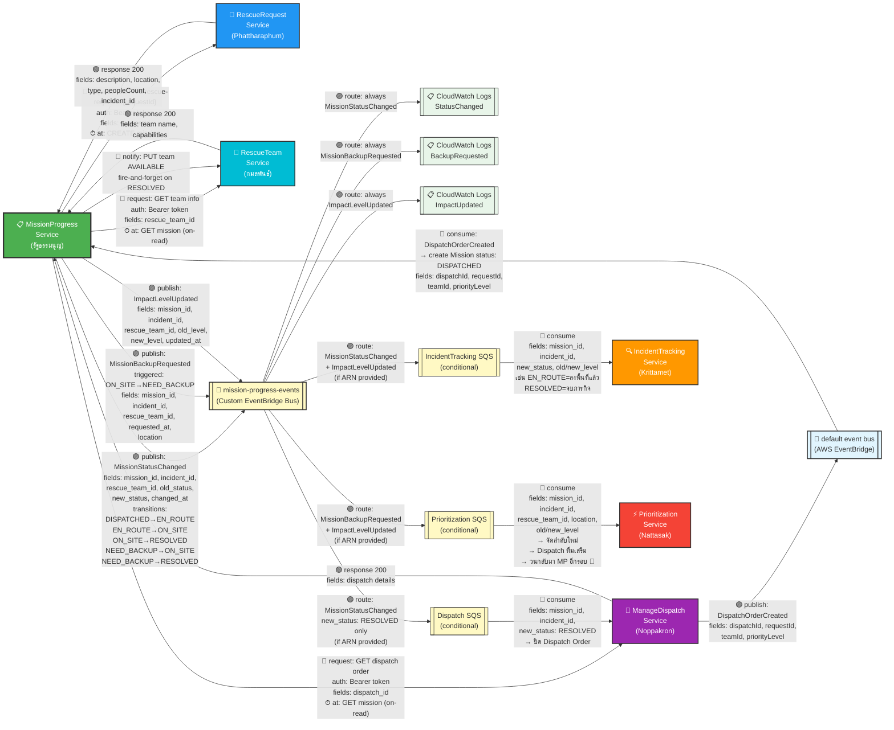

```mermaid
graph LR

    %% ===== Service Nodes =====
    MP["📋 MissionProgress<br/>Service<br/>(รัฐธรรมนูญ)"]
    RR["📝 RescueRequest<br/>Service<br/>(Phattharaphum)"]
    MD["🚀 ManageDispatch<br/>Service<br/>(Noppakron)"]
    RT["👥 RescueTeam<br/>Service<br/>(กมลพันธ์)"]
    IT["🔍 IncidentTracking<br/>Service<br/>(Krittamet)"]
    PR["⚡ Prioritization<br/>Service<br/>(Nattasak)"]

    %% ===== Event Bus / Queues =====
    EB[["📨 mission-progress-events<br/>(Custom EventBridge Bus)"]]
    DEFAULT_EB[["📨 default event bus<br/>(AWS EventBridge)"]]
    CW_LOG1[["📋 CloudWatch Logs<br/>StatusChanged"]]
    CW_LOG2[["📋 CloudWatch Logs<br/>BackupRequested"]]
    CW_LOG3[["📋 CloudWatch Logs<br/>ImpactUpdated"]]
    IT_SQS[["IncidentTracking SQS<br/>(conditional)"]]
    MD_SQS[["Dispatch SQS<br/>(conditional)"]]
    PR_SQS[["Prioritization SQS<br/>(conditional)"]]

    %% ===== Sync Outbound: MP → 3 Services =====
    MP -->|"🔵 request: GET /v1/rescue-requests/{requestId}<br/>auth: Bearer token<br/>fields: requestId<br/>⏱ at: CREATE mission"| RR
    RR -->|"🟢 response 200<br/>fields: description, location,<br/>type, peopleCount, incident_id"| MP

    MP -->|"🔵 request: GET dispatch order<br/>auth: Bearer token<br/>fields: dispatch_id<br/>⏱ at: GET mission (on-read)"| MD
    MD -->|"🟢 response 200<br/>fields: dispatch details"| MP

    MP -->|"🔵 request: GET team info<br/>auth: Bearer token<br/>fields: rescue_team_id<br/>⏱ at: GET mission (on-read)"| RT
    RT -->|"🟢 response 200<br/>fields: team name, capabilities"| MP

    MP -->|"🔵 notify: PUT team AVAILABLE<br/>fire-and-forget on RESOLVED"| RT

    %% ===== Async Inbound: ManageDispatch → MP =====
    MD -->|"🟣 publish: DispatchOrderCreated<br/>fields: dispatchId, requestId,<br/>teamId, priorityLevel"| DEFAULT_EB
    DEFAULT_EB -->|"🔴 consume: DispatchOrderCreated<br/>→ create Mission status: DISPATCHED<br/>fields: dispatchId, requestId,<br/>teamId, priorityLevel"| MP

    %% ===== Async Outbound: MP → Custom EventBridge =====
    MP -->|"🟣 publish: MissionStatusChanged<br/>fields: mission_id, incident_id,<br/>rescue_team_id, old_status,<br/>new_status, changed_at<br/>transitions:<br/>DISPATCHED→EN_ROUTE<br/>EN_ROUTE→ON_SITE<br/>ON_SITE→RESOLVED<br/>NEED_BACKUP→ON_SITE<br/>NEED_BACKUP→RESOLVED"| EB
    MP -->|"🟣 publish: MissionBackupRequested<br/>triggered: ON_SITE→NEED_BACKUP<br/>fields: mission_id, incident_id,<br/>rescue_team_id, requested_at,<br/>location"| EB
    MP -->|"🟣 publish: ImpactLevelUpdated<br/>fields: mission_id, incident_id,<br/>rescue_team_id, old_level,<br/>new_level, updated_at"| EB

    %% ===== EventBridge → CloudWatch Logs (เสมอ) =====
    EB -->|"🟣 route: always<br/>MissionStatusChanged"| CW_LOG1
    EB -->|"🟣 route: always<br/>MissionBackupRequested"| CW_LOG2
    EB -->|"🟣 route: always<br/>ImpactLevelUpdated"| CW_LOG3

    %% ===== EventBridge → SQS (conditional) =====
    EB -->|"🟣 route: MissionStatusChanged<br/>+ ImpactLevelUpdated<br/>(if ARN provided)"| IT_SQS
    EB -->|"🟣 route: MissionStatusChanged<br/>new_status: RESOLVED only<br/>(if ARN provided)"| MD_SQS
    EB -->|"🟣 route: MissionBackupRequested<br/>+ ImpactLevelUpdated<br/>(if ARN provided)"| PR_SQS

    %% ===== SQS → Consumer Services =====
    IT_SQS -->|"🔴 consume<br/>fields: mission_id, incident_id,<br/>new_status, old/new_level<br/>เช่น EN_ROUTE=ลงพื้นที่แล้ว<br/>RESOLVED=จบภารกิจ"| IT
    MD_SQS -->|"🔴 consume<br/>fields: mission_id, incident_id,<br/>new_status: RESOLVED<br/>→ ปิด Dispatch Order"| MD
    PR_SQS -->|"🔴 consume<br/>fields: mission_id, incident_id,<br/>rescue_team_id, location,<br/>old/new_level<br/>→ จัดลำดับใหม่<br/>→ Dispatch ทีมเสริม<br/>→ วนกลับมา MP อีกรอบ 🔄"| PR

    %% ===== Styling =====
    style MP fill:#4CAF50,stroke:#333,stroke-width:3px,color:#fff
    style RR fill:#2196F3,stroke:#333,stroke-width:2px,color:#fff
    style MD fill:#9C27B0,stroke:#333,stroke-width:2px,color:#fff
    style RT fill:#00BCD4,stroke:#333,stroke-width:2px,color:#fff
    style IT fill:#FF9800,stroke:#333,stroke-width:2px,color:#fff
    style PR fill:#F44336,stroke:#333,stroke-width:2px,color:#fff
    style EB fill:#FFF9C4,stroke:#333,stroke-width:2px
    style DEFAULT_EB fill:#E1F5FE,stroke:#333,stroke-width:2px
    style CW_LOG1 fill:#E8F5E9,stroke:#333,stroke-width:1px
    style CW_LOG2 fill:#E8F5E9,stroke:#333,stroke-width:1px
    style CW_LOG3 fill:#E8F5E9,stroke:#333,stroke-width:1px
    style IT_SQS fill:#FFF9C4,stroke:#333,stroke-width:1px
    style MD_SQS fill:#FFF9C4,stroke:#333,stroke-width:1px
    style PR_SQS fill:#FFF9C4,stroke:#333,stroke-width:1px
```
