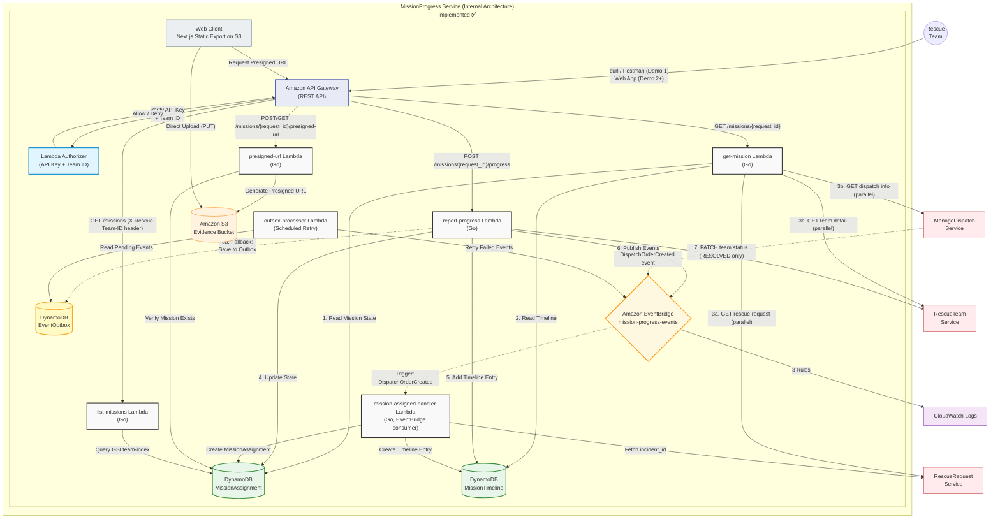

## **Service Architecture**

---

## Architecture Diagram



---

# **Components**

## **1. Amazon API Gateway (REST API)**

### Overview

- Single Entry Point สำหรับทุก HTTP Request
- Routing ตาม Path + Method ไปยัง Lambda ที่เกี่ยวข้อง

### Routes

| Method | Path                                            | Auth   | Target Lambda   |
| ------ | ----------------------------------------------- | ------ | --------------- |
| GET    | /missions/{request_id}                          | CUSTOM | get-mission     |
| POST   | /missions/{request_id}/progress                 | CUSTOM | report-progress |
| POST   | /missions/{request_id}/presigned-url            | CUSTOM | presigned-url   |
| GET    | /missions/{request_id}/presigned-url?image_key= | CUSTOM | presigned-url   |
| GET    | /missions (header: X-Rescue-Team-ID)            | CUSTOM | list-missions   |
| GET    | /health                                         | NONE   | health-check    |

---

## **2. Lambda Authorizer (AuthN + AuthZ)**

### หน้าที่

- ตรวจสอบ Header:
  - `x-api-key` (Authentication)
  - `X-Rescue-Team-ID` (Authorization)

### Behavior

| กรณี               | ผลลัพธ์          |
| ------------------ | ---------------- |
| ถูกต้อง            | ผ่านไปยัง Lambda |
| ไม่ถูกต้อง / ไม่มี | 403 Forbidden    |

> ❗ ไม่เรียก Core Lambda → ประหยัด cost

---

## **3. get-mission Lambda (Go)**

### หน้าที่

- ดึง Mission State + Timeline
- เรียก **3 external services แบบ Parallel** (`sync.WaitGroup`)

### External Calls (Parallel)

| Service        | Endpoint                            | ข้อมูลที่ได้                                    |
| -------------- | ----------------------------------- | ----------------------------------------------- |
| RescueRequest  | GET /v1/rescue-requests/{requestId} | description, location, requestType, peopleCount |
| ManageDispatch | GET /v1/dispatches?teamId={teamId}  | dispatch_status, priority_level                 |
| RescueTeam     | GET /v1/teams/{teamId}              | team_name, team_type, capabilities, equipment   |

### Behavior

| กรณี                        | ผลลัพธ์                |
| --------------------------- | ---------------------- |
| ทั้ง 3 services สำเร็จ      | `data_source: full`    |
| Service ใดล้มเหลว (timeout) | `data_source: partial` |

---

## **4. report-progress Lambda (Go)**

### หน้าที่

- Validate State Machine
- Update DynamoDB
- Publish Events → EventBridge

### Flow

- Validate Transition
- Update MissionAssignment
- Insert MissionTimeline
- Publish Events (สูงสุด 3 events)
- Fallback → Outbox Pattern

---

## **5. Amazon DynamoDB**

### Tables

| Table             | PK         | SK         | GSI                                                                                         |
| ----------------- | ---------- | ---------- | ------------------------------------------------------------------------------------------- |
| MissionAssignment | mission_id | —          | `request-index` (request_id), `team-index` (rescue_team_id), `dispatch-index` (dispatch_id) |
| MissionTimeline   | mission_id | timestamp  | `log-id-index` (log_id)                                                                     |
| EventOutbox       | outbox_id  | created_at | `status-index` (status), TTL enabled                                                        |

### Notes

- ใช้ **On-Demand (PAY_PER_REQUEST)**
- `dispatch-index` ใช้ใน `mission-assigned-handler` สำหรับ idempotency check

---

## **6. Amazon EventBridge**

### Overview

- Custom Bus: `mission-progress-events`
- ใช้สำหรับ Event-driven communication

### Events

| Event                  | Trigger                 | สถานะปัจจุบัน                                           |
| ---------------------- | ----------------------- | ------------------------------------------------------- |
| MissionStatusChanged   | ทุกครั้งที่สถานะเปลี่ยน | ✅ SQS Route Active (IncidentTracking + Dispatch)       |
| MissionBackupRequested | NEED_BACKUP             | ✅ SQS Route Active (Prioritization)                    |
| ImpactLevelUpdated     | มี new_impact_level     | ✅ SQS Route Active (IncidentTracking + Prioritization) |

---

## **7. External Services**

### RescueRequest Service

| Lambda                   | Endpoint                            | Timeout | Retry |
| ------------------------ | ----------------------------------- | ------- | ----- |
| get-mission              | GET /v1/rescue-requests/{requestId} | 800ms   | 2     |
| mission-assigned-handler | GET /v1/rescue-requests/{requestId} | 800ms   | 2     |

### ManageDispatch Service

| Lambda      | Endpoint                           | Timeout | Retry |
| ----------- | ---------------------------------- | ------- | ----- |
| get-mission | GET /v1/dispatches?teamId={teamId} | 800ms   | 2     |

### RescueTeam Service

| Lambda          | Endpoint                        | Timeout | Retry                           |
| --------------- | ------------------------------- | ------- | ------------------------------- |
| get-mission     | GET /v1/teams/{teamId}          | 800ms   | 2                               |
| report-progress | PATCH /v1/teams/{teamId}/status | 800ms   | 2 (fire-and-forget on RESOLVED) |

---

## **8. Web Client (Next.js) ✅**

- Static Export (deploy บน S3)
- รองรับ Mobile
- ไม่ต้อง install app

---

## **9. presigned-url Lambda ✅**

### หน้าที่

- POST: Generate S3 Presigned URL สำหรับ upload (PUT, 5 นาที)
- GET: Generate S3 Presigned URL สำหรับ view (GET, 5 นาที)

### Validation (POST)

- `file_name` ต้องมี
- `content_type` ต้องเป็น `image/jpeg`, `image/png`, หรือ `image/webp`

### S3 Key Format

`evidence/{mission_id}/{rescue_team_id}/{unix_timestamp}-{file_name}`

### Output

- POST: `{ upload_url, image_key, expires_in }`
- GET: `{ view_url, image_key, expires_in }`

---

## **10. list-missions Lambda ✅**

### หน้าที่

- Query ภารกิจของทีมผ่าน `team-index` GSI
- Team ID มาจาก **`X-Rescue-Team-ID` header** (ไม่ใช่ query param)

### Behavior

| กรณี         | Response              |
| ------------ | --------------------- |
| พบข้อมูล     | missions[]            |
| ไม่พบ        | 200 OK + []           |
| ไม่มี header | 400 MISSING_PARAMETER |

---

## **11. S3 Evidence Bucket ✅**

- เก็บรูปภาพหลักฐาน
- Upload ผ่าน Presigned URL (PUT)
- View ผ่าน Presigned URL (GET)

---

## **12. outbox-processor Lambda ✅**

### หน้าที่

- Retry EventBridge events ที่ล้มเหลว (Scheduled)

### Flow

- Scan `status = PENDING/FAILED` และ `retry_count < 5`
- Retry → EventBridge
- Update status → `SENT` / `FAILED` (ถ้าครบ 5 ครั้ง)

---

## **13. mission-assigned-handler Lambda ✅**

### หน้าที่

- EventBridge consumer สำหรับ `DispatchOrderCreated` จาก Manage Dispatch Service
- สร้าง MissionAssignment และ Timeline entry แรก

### Flow

1. รับ `DispatchOrderCreated` event
2. Idempotency check ด้วย `dispatch_id` (GSI `dispatch-index`)
3. ดึง `incident_id` จาก RescueRequest Service (degraded ถ้าล้มเหลว)
4. สร้าง MissionAssignment (`status = DISPATCHED`, `mission_id = MISS-{uuid8}`)
5. สร้าง Timeline entry (`action_type = MISSION_ASSIGNED`)

---

# **Explanation**

---

## **1. Authentication Flow**

- ทุก request ต้องมี:
  - `x-api-key`
  - `X-Rescue-Team-ID`

| ผลลัพธ์ | Behavior |
| ------- | -------- |
| ✅      | ผ่าน     |
| ❌      | 403      |

---

## **2. GET Flow — Mission + Timeline**

- GET `/missions/{request_id}`
- ดึง:
  - MissionAssignment (DynamoDB)
  - MissionTimeline (DynamoDB)
  - RescueRequest data (parallel HTTP)
  - ManageDispatch data (parallel HTTP)
  - RescueTeam data (parallel HTTP)

### Key Behavior

- ทั้ง 3 services สำเร็จ → `full`
- Service ใดล้มเหลว → `partial (Degraded Mode)`

---

## **3. POST Flow — Update + Event**

- POST `/progress`

### Steps

1. Validate State
2. Update DB
3. Insert Timeline
4. Publish Events
5. Fallback → Outbox

---

### State Transition

| จาก         | ไปได้                 |
| ----------- | --------------------- |
| DISPATCHED  | EN_ROUTE              |
| EN_ROUTE    | ON_SITE               |
| ON_SITE     | NEED_BACKUP, RESOLVED |
| NEED_BACKUP | ON_SITE, RESOLVED     |
| RESOLVED    | ❌ Final State        |

---

### Event Mapping

| Event                  | Trigger     | Target                                     |
| ---------------------- | ----------- | ------------------------------------------ |
| MissionStatusChanged   | ทุกครั้ง    | ✅ SQS → IncidentTracking + Dispatch       |
| MissionBackupRequested | NEED_BACKUP | ✅ SQS → Prioritization                    |
| ImpactLevelUpdated     | มี impact   | ✅ SQS → IncidentTracking + Prioritization |

---

## **4. Reliability & Failure Handling**

### 🔹 Level 1 — Degraded Mode

- IncidentTracking ล้มเหลว
  → ใช้ข้อมูล local

---

### 🔹 Level 2 — Outbox Pattern

```
Lambda Publish ล้มเหลว
        ↓
บันทึก EventOutbox (PENDING)
        ↓
Processor retry
        ↓
SENT / FAILED
```

---

### 🔹 Level 3 — Authorizer ล่ม

- API Gateway → 500

---

### 🔹 Level 4 — Client Resilience (Demo 2+)

- เก็บ request ใน localStorage
- retry เมื่อ online

---

## **5. Evidence Upload Flow**

### Step

1. ขอ Presigned URL
2. Upload → S3
3. ส่ง image_key กลับมา

### ข้อดี

- รองรับไฟล์ใหญ่ (≤ 5GB)
- ลดภาระ Lambda

---

## **6. List Missions Flow**

- Query ผ่าน GSI `team-index`
- รองรับ filter status

### Behavior

| กรณี     | Response   |
| -------- | ---------- |
| มีข้อมูล | missions[] |
| ไม่มี    | []         |

---
