## **Service Architecture**

---

## Architecture Diagram

```mermaid
graph TD
    %% --- External ---
    User((Rescue<br>Team))
    IncidentAPI["IncidentTracking<br>Service<br>(Mock in Demo 1)"]
    ExtLog["CloudWatch Logs<br>(Demo 1 Target)"]

    %% --- Internal Service ---
    subgraph MissionProgress_Service ["MissionProgress Service (Internal Architecture)"]

        subgraph Implemented ["Demo 1 — Implemented ✅"]
            AGW["Amazon API Gateway<br>(REST API)"]
            Auth["Lambda Authorizer<br>(API Key + Team ID)"]
            GetLambda["get-mission Lambda<br>(Go)"]
            PostLambda["report-progress Lambda<br>(Go)"]
            DB_Assign[("DynamoDB<br>MissionAssignment")]
            DB_Timeline[("DynamoDB<br>MissionTimeline")]
            DB_Outbox[("DynamoDB<br>EventOutbox")]
            EB{"Amazon EventBridge<br>mission-progress-events"}
        end

        subgraph Planned ["Demo 2+ — Planned 🔜"]
            UI["Web Client<br>Next.js Static Export on S3"]
            Storage[("Amazon S3<br>Evidence Bucket")]
            PresignLambda["presigned-url Lambda<br>(Go)"]
            ListLambda["list-missions Lambda<br>(Go)"]
            OutboxProc["outbox-processor Lambda<br>(Scheduled Retry)"]
        end
    end

    %% --- User Flow ---
    User -->|"curl / Postman (Demo 1)<br>Web App (Demo 2+)"| AGW

    %% --- Auth ---
    AGW -->|"Verify API Key<br>+ Team ID"| Auth
    Auth -->|"Allow / Deny"| AGW

    %% --- GET /incidents/{id} ---
    AGW -->|"GET /incidents/{id}"| GetLambda
    GetLambda -->|"1. Read Mission State"| DB_Assign
    GetLambda -->|"2. Read Timeline"| DB_Timeline
    GetLambda -.->|"3. HTTP GET<br>(Degraded Mode)"| IncidentAPI

    %% --- POST /incidents/{id}/progress ---
    AGW -->|"POST /incidents/{id}/progress"| PostLambda
    PostLambda -->|"4. Update State"| DB_Assign
    PostLambda -->|"5. Add Timeline Entry"| DB_Timeline
    PostLambda -->|"6. Publish Events"| EB
    PostLambda -.->|"6b. Fallback:<br>Save to Outbox"| DB_Outbox

    %% --- EventBridge ---
    EB -->|"3 Rules"| ExtLog

    %% --- Demo 2+: POST /incidents/{id}/presigned-url ---
    AGW -.->|"POST /incidents/{id}/presigned-url"| PresignLambda
    PresignLambda -.->|"Verify Mission Exists"| DB_Assign
    PresignLambda -.->|"Generate Presigned URL"| Storage

    %% --- Demo 2+: GET /incidents?team_id= ---
    AGW -.->|"GET /incidents?team_id="| ListLambda
    ListLambda -.->|"Query GSI team-index"| DB_Assign

    %% --- Demo 2+ Frontend flows ---
    UI -.->|"Request Presigned URL"| AGW
    UI -.->|"Direct Upload (PUT)"| Storage

    %% --- Demo 2+ Outbox ---
    OutboxProc -.->|"Retry Failed Events"| EB
    OutboxProc -.->|"Read Pending Events"| DB_Outbox

    %% --- Styling ---
    style AGW fill:#e8eaf6,stroke:#3f51b5,stroke-width:2px
    style Auth fill:#e1f5fe,stroke:#0288d1,stroke-width:2px
    style GetLambda fill:#f9f9f9,stroke:#333,stroke-width:2px
    style PostLambda fill:#f9f9f9,stroke:#333,stroke-width:2px
    style DB_Assign fill:#e8f5e9,stroke:#388e3c,stroke-width:2px
    style DB_Timeline fill:#e8f5e9,stroke:#388e3c,stroke-width:2px
    style DB_Outbox fill:#fff9c4,stroke:#f9a825,stroke-width:2px
    style EB fill:#fff8e1,stroke:#ff8f00,stroke-width:2px
    style ExtLog fill:#f3e5f5,stroke:#7b1fa2,stroke-width:1px
    style IncidentAPI fill:#ffebee,stroke:#c62828,stroke-width:1px,stroke-dasharray: 5 5
    style UI fill:#eceff1,stroke:#607d8b,stroke-width:1px,stroke-dasharray: 5 5
    style Storage fill:#fff3e0,stroke:#f57c00,stroke-width:1px,stroke-dasharray: 5 5
    style PresignLambda fill:#f9f9f9,stroke:#999,stroke-width:1px,stroke-dasharray: 5 5
    style ListLambda fill:#f9f9f9,stroke:#999,stroke-width:1px,stroke-dasharray: 5 5
    style OutboxProc fill:#f9f9f9,stroke:#999,stroke-width:1px,stroke-dasharray: 5 5
```



---

# **Components**

## **1. Amazon API Gateway (REST API)**

### Overview

- Single Entry Point สำหรับทุก HTTP Request
- Routing ตาม Path + Method ไปยัง Lambda ที่เกี่ยวข้อง

### Routes

| Method | Path                          | Target Lambda   |
| ------ | ----------------------------- | --------------- |
| GET    | /incidents/{id}               | get-mission     |
| POST   | /incidents/{id}/progress      | report-progress |
| POST   | /incidents/{id}/presigned-url | presigned-url   |
| GET    | /incidents?team_id={id}       | list-missions   |

---

## **2. Lambda Authorizer (AuthN + AuthZ)**

### หน้าที่

- ตรวจสอบ Header:
  - `x-api-key` (Authentication)
  - `X-Rescue-Team-ID` (Authorization)

### Behavior

| กรณี               | ผลลัพธ์          |
| ------------------ | ---------------- |
| ถูกต้อง            | ผ่านไปยัง Lambda |
| ไม่ถูกต้อง / ไม่มี | 403 Forbidden    |

> ❗ ไม่เรียก Core Lambda → ประหยัด cost

---

## **3. get-mission Lambda (Go)**

### หน้าที่

- ดึง Mission State + Timeline
- เรียก IncidentTracking Service

### Behavior

| กรณี                 | ผลลัพธ์                |
| -------------------- | ---------------------- |
| เรียก Service สำเร็จ | `data_source: full`    |
| ล้มเหลว (timeout)    | `data_source: partial` |

> ⚠️ Demo 1: Mock → timeout → Degraded Mode เสมอ

---

## **4. report-progress Lambda (Go)**

### หน้าที่

- Validate State Machine
- Update DynamoDB
- Publish Events → EventBridge

### Flow

- Validate Transition
- Update MissionAssignment
- Insert MissionTimeline
- Publish Events (สูงสุด 3 events)
- Fallback → Outbox Pattern

---

## **5. Amazon DynamoDB**

### Tables

| Table             | PK         | SK         | Purpose                       |
| ----------------- | ---------- | ---------- | ----------------------------- |
| MissionAssignment | mission_id | —          | สถานะปัจจุบัน                 |
| MissionTimeline   | mission_id | timestamp  | Timeline                      |
| EventOutbox       | outbox_id  | created_at | Retry events (Outbox Pattern) |

### Notes

- ใช้ **On-Demand (PAY_PER_REQUEST)**
- มี GSI: `team-index` สำหรับ list missions

---

## **6. Amazon EventBridge**

### Overview

- Custom Bus: `mission-progress-events`
- ใช้สำหรับ Event-driven communication

### Events

| Event                  | Trigger                 | Demo 1          | Demo 2+                   |
| ---------------------- | ----------------------- | --------------- | ------------------------- |
| MissionStatusChanged   | ทุกครั้งที่สถานะเปลี่ยน | CloudWatch Logs | Incident + Dispatch       |
| MissionBackupRequested | NEED_BACKUP             | CloudWatch Logs | Prioritization            |
| ImpactLevelUpdated     | มี new_impact_level     | CloudWatch Logs | Incident + Prioritization |

---

## **7. IncidentTracking Service**

### หน้าที่

- ให้ข้อมูล Incident (description, location, type)

### Behavior

| Demo | Behavior                       |
| ---- | ------------------------------ |
| 1    | Mock → timeout → Degraded Mode |
| 2+   | ใช้ service จริง → Full Mode   |

---

## **8. [Demo 2+] Web Client (Next.js)**

- Static Export (deploy บน S3)
- รองรับ Mobile
- ไม่ต้อง install app

---

## **9. [Demo 2+] presigned-url Lambda**

### หน้าที่

- Generate S3 Presigned URL (PUT, 5 นาที)

### Validation

- file_name ต้องมี
- content_type ต้องเป็น jpeg/png/webp

### Output

- `{ upload_url, image_key, expires_in }`

---

## **10. [Demo 2+] list-missions Lambda**

### หน้าที่

- Query ภารกิจของทีมผ่าน `team-index`

### Behavior

| กรณี     | Response    |
| -------- | ----------- |
| พบข้อมูล | missions[]  |
| ไม่พบ    | 200 OK + [] |

---

## **11. [Demo 2+] S3 Evidence Bucket**

- เก็บรูปภาพหลักฐาน
- Upload ผ่าน Presigned URL

---

## **12. [Demo 2+] outbox-processor Lambda**

### หน้าที่

- Retry Event ที่ล้มเหลว

### Flow

- Scan `status = PENDING`
- Retry → EventBridge
- Update status → SENT / FAILED

---

# **Explanation**

---

## **1. Authentication Flow**

- ทุก request ต้องมี:
  - `x-api-key`
  - `X-Rescue-Team-ID`

| ผลลัพธ์ | Behavior |
| ------- | -------- |
| ✅      | ผ่าน     |
| ❌      | 403      |

---

## **2. GET Flow — Mission + Timeline**

- GET `/incidents/{id}`
- ดึง:
  - MissionAssignment
  - MissionTimeline
  - IncidentTracking

### Key Behavior

- สำเร็จ → `full`
- ล้มเหลว → `partial (Degraded Mode)`

---

## **3. POST Flow — Update + Event**

- POST `/progress`

### Steps

1. Validate State
2. Update DB
3. Insert Timeline
4. Publish Events
5. Fallback → Outbox

---

### State Transition

| จาก         | ไปได้                 |
| ----------- | --------------------- |
| DISPATCHED  | EN_ROUTE              |
| EN_ROUTE    | ON_SITE               |
| ON_SITE     | NEED_BACKUP, RESOLVED |
| NEED_BACKUP | ON_SITE, RESOLVED     |
| RESOLVED    | ❌ Final State        |

---

### Event Mapping

| Event                  | Trigger     | Target (Demo 2+)          |
| ---------------------- | ----------- | ------------------------- |
| MissionStatusChanged   | ทุกครั้ง    | Incident + Dispatch       |
| MissionBackupRequested | NEED_BACKUP | Prioritization            |
| ImpactLevelUpdated     | มี impact   | Incident + Prioritization |

---

## **4. Reliability & Failure Handling**

### 🔹 Level 1 — Degraded Mode

- IncidentTracking ล้มเหลว
  → ใช้ข้อมูล local

---

### 🔹 Level 2 — Outbox Pattern

```
Lambda Publish ล้มเหลว
        ↓
บันทึก EventOutbox (PENDING)
        ↓
Processor retry
        ↓
SENT / FAILED
```

---

### 🔹 Level 3 — Authorizer ล่ม

- API Gateway → 500

---

### 🔹 Level 4 — Client Resilience (Demo 2+)

- เก็บ request ใน localStorage
- retry เมื่อ online

---

## **5. Evidence Upload Flow**

### Step

1. ขอ Presigned URL
2. Upload → S3
3. ส่ง image_key กลับมา

### ข้อดี

- รองรับไฟล์ใหญ่ (≤ 5GB)
- ลดภาระ Lambda

---

## **6. List Missions Flow**

- Query ผ่าน GSI `team-index`
- รองรับ filter status

### Behavior

| กรณี     | Response   |
| -------- | ---------- |
| มีข้อมูล | missions[] |
| ไม่มี    | []         |

---
