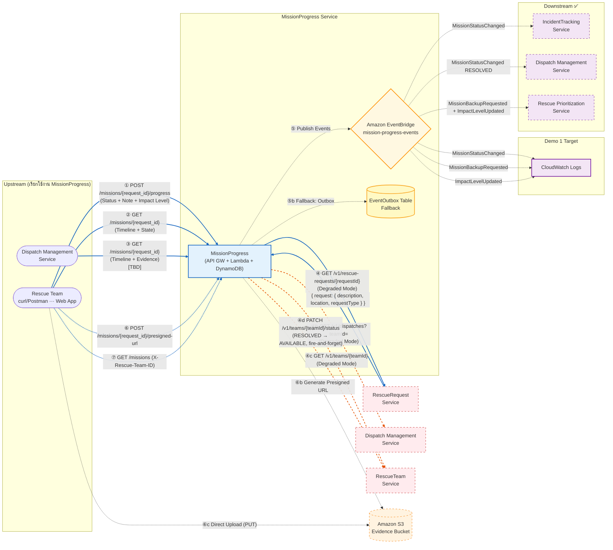

# **Service Interaction Diagram**



## **คำอธิบาย Flow**

| สัญลักษณ์           | ความหมาย                                               |
| ------------------- | ------------------------------------------------------ |
| **เส้นทึบ (═══)**   | Synchronous — รอผลตอบกลับทันที (HTTP Request/Response) |
| **เส้นประ (- - -)** | Asynchronous — ส่งแล้วไม่รอผล (Event ผ่าน EventBridge) |

---

# Upstream Services (บริการที่เรียกใช้งาน MissionProgress)

---

## ① POST /missions/{request_id}/progress — Rescue Team

| รายละเอียด  | ค่า                                       |
| :---------- | :---------------------------------------- |
| **Purpose** | รายงานสถานะล่าสุดจากหน้างาน               |
| **Method**  | `POST`                                    |
| **Auth**    | `x-api-key` + `X-Rescue-Team-ID`          |
| **Lambda**  | `report-progress` (Go)                    |
| **Client**  | curl/Postman (Demo 1) → Web App (Demo 2+) |
| **Demo 1**  | ✅ Implemented                            |

#### Request Body

```json
{
  "new_status": "ON_SITE",
  "note": "ถึงจุดเกิดเหตุแล้ว น้ำสูง 1.2m",
  "new_impact_level": 3, // optional Integer
  "current_location": "13.7563,100.5018", // optional String
  "image_key": "evidence/MISS-abc/TEAM-ALPHA/1718352735-x.jpg" // optional
}
```

#### Response `200`

```json
{
  "message": "Progress reported successfully",
  "mission_id": "MISS-a1b2c3d4",
  "request_id": "REQ-001",
  "incident_id": "INC-001",
  "old_status": "EN_ROUTE",
  "new_status": "ON_SITE",
  "updated_at": "2025-..."
}
```

---

## ② GET /missions/{request_id} — Rescue Team

| รายละเอียด  | ค่า                              |
| :---------- | :------------------------------- |
| **Purpose** | ดึง Timeline + สถานะปัจจุบัน     |
| **Method**  | `GET`                            |
| **Auth**    | `x-api-key` + `X-Rescue-Team-ID` |
| **Lambda**  | `get-mission` (Go)               |
| **Demo 1**  | ✅ Implemented                   |

#### Response `200`

```json
{
  "request_id": "REQ-001",
  "incident_id": "INC-001",
  "mission_id": "MSN-001",
  "dispatch_id": "DSP-001",
  "rescue_team_id": "TEAM-ALPHA",
  "team_name": "Alpha Rescue Unit",
  "team_type": "FLOOD",
  "capabilities": ["swift_water_rescue", "first_aid"],
  "equipment": ["boat", "lifejackets"],
  "team_location": { "lat": 13.7563, "lng": 100.5018 },
  "priority_level": 2,
  "dispatch_status": "ACTIVE",
  "current_status": "ON_SITE",
  "latest_impact_level": 3,
  "started_at": "2024-12-01T08:00:00Z",
  "last_updated_at": "2025-06-14T09:32:15Z",
  "description": "น้ำท่วมหนักบริเวณถนนพหลโยธิน",
  "location": "13.7563,100.5018",
  "incident_type": "FLOOD",
  "timeline": [ ... ],
  "data_source": "full"
}
```

> - `data_source: "full"` — เรียก RescueRequest + ManageDispatch + RescueTeam ครบ
> - `data_source: "partial"` — service ใดservice หนึ่งล้มเหลว (Degraded Mode) — omitempty fields จะหายไปจาก response

---

## ③ GET /missions/{request_id} — Dispatch Management Service

| รายละเอียด  | ค่า                                            |
| :---------- | :--------------------------------------------- |
| **Purpose** | Dispatcher ดู Timeline ละเอียด + รูปภาพหลักฐาน |
| **Method**  | `GET` (ใช้ endpoint เดียวกับ ②)                |
| **Status**  | \[TBD: Pending Discussion กับ Noppakron]       |

#### ทำไม Dispatch อาจต้องเรียก GET API (ไม่ใช่แค่ฟัง Event)

| ข้อมูลที่ Dispatcher ต้องการ |         ได้จาก Event?          | ได้จาก GET API? |
| :--------------------------- | :----------------------------: | :-------------: |
| สถานะปัจจุบัน                |               ✅               |       ✅        |
| Timeline ทั้งหมดย้อนหลัง     | ❌ (Event ส่งแค่ entry ล่าสุด) |       ✅        |
| รูปภาพหลักฐาน (Demo 2+)      |               ❌               |       ✅        |

---

## ⑥ POST /missions/{request_id}/presigned-url — Rescue Team ✅

| รายละเอียด  | ค่า                                      |
| :---------- | :--------------------------------------- |
| **Purpose** | ขอ Presigned URL สำหรับอัปโหลดรูปหลักฐาน |
| **Method**  | `POST`                                   |
| **Auth**    | `x-api-key` + `X-Rescue-Team-ID`         |
| **Lambda**  | `presigned-url` (Go)                     |
| **Demo 2**  | ✅ Implemented                           |

#### Request Body

```json
{
  "file_name": "flood-evidence-001.jpg",
  "content_type": "image/jpeg"
}
```

#### Response `200`

```json
{
  "upload_url": "https://s3.amazonaws.com/...",
  "image_key": "evidence/REQ-001/TEAM-ALPHA/1718352735-flood-evidence-001.jpg",
  "expires_in": 300,
  "message": "Presigned URL generated successfully"
}
```

#### Full Upload Flow

```
⑥a.  Frontend  →  POST /missions/{request_id}/presigned-url  →  Lambda
⑥b.  Lambda    →  S3 (Generate PUT Presigned URL)       →  Return upload_url + image_key
⑥c.  Frontend  →  S3 (Direct PUT Upload ด้วย Presigned URL)
⑥d.  Frontend  →  POST /missions/{request_id}/progress (แนบ image_key)  →  เชื่อม Evidence กับ Timeline entry
```

## GET /missions/{request_id}/presigned-url?image_key= — Rescue Team ✅

| รายละเอียด  | ค่า                                       |
| :---------- | :---------------------------------------- |
| **Purpose** | ขอ Presigned URL สำหรับดูรูปหลักฐาน       |
| **Method**  | `GET`                                     |
| **Auth**    | `x-api-key` + `X-Rescue-Team-ID`          |
| **Lambda**  | `presigned-url` (Go)                      |
| **Query**   | `image_key=evidence/MISS-abc/TEAM-01/...` |
| **Demo 2**  | ✅ Implemented                            |

#### Response `200`

```json
{
  "view_url": "https://s3.amazonaws.com/...",
  "image_key": "evidence/MISS-abc/TEAM-ALPHA/1718352735-flood-evidence-001.jpg",
  "expires_in": 300,
  "message": "Presigned URL generated successfully"
}
```

---

## ⑦ GET /missions — Rescue Team ✅

| รายละเอียด  | ค่า                              |
| :---------- | :------------------------------- |
| **Purpose** | ดึงรายการภารกิจทั้งหมดของทีม     |
| **Method**  | `GET`                            |
| **Auth**    | `x-api-key` + `X-Rescue-Team-ID` |
| **Lambda**  | `list-missions` (Go)             |
| **Demo 2**  | ✅ Implemented                   |

#### Query Parameters

| Parameter | Required | Description                        |
| :-------- | :------: | :--------------------------------- |
| `status`  |    ❌    | กรอง เช่น `ON_SITE`, `NEED_BACKUP` |

> **Team ID มาจาก `X-Rescue-Team-ID` header** — ไม่ใช่ query parameter

#### Response `200`

```json
{
  "team_id": "TEAM-ALPHA",
  "total_missions": 3,
  "missions": [
    {
      "mission_id": "MSN-001",
      "request_id": "REQ-001",
      "current_status": "ON_SITE",
      "latest_impact_level": 3,
      "started_at": "2024-12-01T08:00:00Z",
      "last_updated_at": "2025-06-14T09:32:15Z"
    },
    ...
  ]
}
```

---

## ⑧ DispatchOrderCreated — จาก Dispatch Management Service (Inbound Async) ✅

| รายละเอียด  | ค่า                                        |
| :---------- | :----------------------------------------- |
| **Source**  | Dispatch Management Service                |
| **Trigger** | เมื่อ Dispatcher มอบหมายภารกิจให้ทีมกู้ภัย |
| **Channel** | EventBridge                                |
| **Lambda**  | `mission-assigned-handler` (Go)            |
| **Demo 2**  | ✅ Implemented                             |

#### Expected Payload

```json
{
  "source": "dispatch-management-service",
  "detail-type": "DispatchOrderCreated",
  "detail": {
    "dispatchId": "DSP-001",
    "requestId": "REQ-001",
    "teamId": "TEAM-ALPHA",
    "priorityLevel": 2,
    "status": "ACTIVE",
    "dispatchedAt": "2025-06-14T08:45:00Z"
  }
}
```

#### mission-assigned-handler จะทำอะไร

1. Idempotency check ด้วย `dispatch_id` (GSI `dispatch-index`) — ถ้า mission มีอยู่แล้ว → skip
2. ดึง `incident_id` จาก RescueRequest Service (degraded ถ้าล้มเหลว: `incident_id = ""`)
3. สร้าง MissionAssignment (`status = DISPATCHED`, `mission_id = MISS-{uuid8}`)
4. สร้าง Timeline entry (`action_type = MISSION_ASSIGNED`)

---

---

# Downstream Services (บริการปลายทางที่ MissionProgress เรียกหรือส่งข้อมูลไป)

MissionProgress สื่อสารกับ Downstream ผ่าน **2 ช่องทาง**:

- **Synchronous (HTTP)** — เรียกดึงข้อมูลแบบรอผลตอบกลับ
- **Asynchronous (EventBridge Events)** — ส่ง Event แล้วไม่รอผล

---

## 1. RescueRequest Service

> **Owner:** Phattharaphum Kingchai
> **บทบาท:** เป็น Source of Truth ของข้อมูล Request (description, location, requestType)

#### การสื่อสาร

|  #  | ช่องทาง                                             | ทิศทาง                              | รายละเอียด                                                                                    | Demo 1               | Demo 2+             |
| :-: | :-------------------------------------------------- | :---------------------------------- | :-------------------------------------------------------------------------------------------- | :------------------- | :------------------ |
|  ④  | Sync `GET /v1/rescue-requests/{requestId}` (Bearer) | MissionProgress → RescueRequest     | ดึง description, location, requestType (ถ้าล้มเหลว → Degraded Mode, `data_source: "partial"`) | ✅ Active (parallel) | ✅ Active           |
| ⑤a  | Async `MissionStatusChanged`                        | MissionProgress → RescueRequest[^1] | แจ้งอัปเดตสถานะ Request ที่เชื่อมโยง                                                          | ✅ Active            | ✅ SQS Route Active |

[^1]: RescueRequest Service รับ Event ผ่าน EventBridge หากมีการตั้งค่า rule

#### Expected API Response (Sync GET)

```json
{
  "request": {
    "requestId": "REQ-001",
    "description": "น้ำท่วมหนักบริเวณถนนพหลโยธิน",
    "location": {
      "latitude": 13.7563,
      "longitude": 100.5018
    },
    "requestType": "FLOOD"
  }
}
```

#### Failure Handling

| กรณี                                        | การจัดการ                                                                  |
| :------------------------------------------ | :------------------------------------------------------------------------- |
| Sync GET ล้มเหลว (timeout 800ms + retry 2x) | **Degraded Mode** — ส่งเฉพาะข้อมูลที่มี → ทีมกู้ภัยยังทำงานได้ปกติ         |
| Async Event Publish ล้มเหลว                 | **Outbox Pattern** → บันทึกลง EventOutbox → outbox-processor retry ส่งใหม่ |

---

## 2. IncidentTracking Service

> **Owner:** Krittamet Damthongkam
> **บทบาท:** รับ Async Events จาก MissionProgress (ไม่มี Sync call แล้ว)

#### การสื่อสาร

|  #  | ช่องทาง                      | ทิศทาง                             | รายละเอียด                                           | Demo 1    | Demo 2+             |
| :-: | :--------------------------- | :--------------------------------- | :--------------------------------------------------- | :-------- | :------------------ |
| ⑤a  | Async `MissionStatusChanged` | MissionProgress → IncidentTracking | อัปเดตสถานะรวมของ Incident (เช่น "In Progress")      | ✅ Active | ✅ SQS Route Active |
| ⑤b  | Async `ImpactLevelUpdated`   | MissionProgress → IncidentTracking | ส่ง Impact Level ล่าสุด → IncidentTracking อัปเดต MD | ✅ Active | ✅ SQS Route Active |

#### Failure Handling

| กรณี                                  | การจัดการ                                                      |
| :------------------------------------ | :------------------------------------------------------------- |
| Async Event Publish ล้มเหลว           | ✅ Outbox Pattern → EventOutbox table → outbox-processor retry |
| EventBridge → Incident Target ล้มเหลว | EventBridge built-in retry (24 ชั่วโมง)                        |

---

## 3. Dispatch Management Service

> **Owner:** Noppakron Songkroh
> **บทบาท:** จัดการการมอบหมายงานและสถานะทีมกู้ภัย (BUSY/AVAILABLE)

#### การสื่อสาร

|  #  | ช่องทาง                                       | ทิศทาง                     | รายละเอียด                                                                       | Demo 1               | Demo 2+             |
| :-: | :-------------------------------------------- | :------------------------- | :------------------------------------------------------------------------------- | :------------------- | :------------------ |
| ④b  | Sync `GET /v1/dispatches?teamId={teamId}`     | MissionProgress → Dispatch | ดึง dispatch status, priority level (ล้มเหลว → Degraded Mode, omit จาก response) | ✅ Active (parallel) | ✅ Active           |
| ⑤b  | Async `MissionStatusChanged` (Rule: RESOLVED) | MissionProgress → Dispatch | แจ้งว่าภารกิจเสร็จ → ปลดล็อคทีมกู้ภัย (BUSY → AVAILABLE)                         | ✅ Active            | ✅ SQS Route Active |

#### Expected API Response (④b Sync GET)

```json
{
  "teamId": "TEAM-ALPHA",
  "items": [
    {
      "dispatchId": "DSP-001",
      "requestId": "REQ-001",
      "status": "ACTIVE",
      "priorityLevel": 2,
      "dispatchedAt": "2025-06-14T08:45:00Z"
    }
  ]
}
```

#### EventBridge Rule Filter (⑤b Async)

```json
{
  "source": ["MissionProgressService"],
  "detail-type": ["MissionStatusChanged"],
  "detail": {
    "new_status": ["RESOLVED"]
  }
}
```

> _หมายเหตุ: Dispatch ยังเป็น Upstream ด้วย — ส่ง `DispatchOrderCreated` event เข้ามา (⑦) + อาจเรียก GET API (③)_

#### Failure Handling

| กรณี                                  | การจัดการ                                                                 |
| :------------------------------------ | :------------------------------------------------------------------------ |
| Sync GET ล้มเหลว                      | **Degraded Mode** → omit `dispatch_status`, `priority_level` จาก response |
| EventBridge Publish ล้มเหลว           | ✅ Outbox Pattern → EventOutbox table → outbox-processor retry            |
| EventBridge → Dispatch Target ล้มเหลว | EventBridge built-in retry (24 ชั่วโมง)                                   |

---

## 4. Rescue Prioritization Service

> **Owner:** Nattasak Chonmanat
> **บทบาท:** จัดลำดับความสำคัญและความเร่งด่วนของแต่ละเคส (Priority Score)

#### การสื่อสาร

|  #  | ช่องทาง                        | ทิศทาง                           | รายละเอียด                                                           | Demo 1    | Demo 2+             |
| :-: | :----------------------------- | :------------------------------- | :------------------------------------------------------------------- | :-------- | :------------------ |
| ⑤c  | Async `MissionBackupRequested` | MissionProgress → Prioritization | ทีมกู้ภัยต้องการกำลังเสริม (NEED_BACKUP) → คำนวณ Priority Score ใหม่ | ✅ Active | ✅ SQS Route Active |
| ⑤d  | Async `ImpactLevelUpdated`     | MissionProgress → Prioritization | ส่ง Impact Level ล่าสุด → คำนวณลำดับความสำคัญใหม่                    | ✅ Active | ✅ SQS Route Active |

#### Failure Handling

| กรณี                           | การจัดการ                                                          |
| :----------------------------- | :----------------------------------------------------------------- |
| EventBridge Publish ล้มเหลว    | **Outbox Pattern** (safety net สำหรับ retry)                       |
| Event ส่งไม่ถึง Prioritization | **Non-blocking** — ระบบกู้ภัยยังทำงานต่อได้ (ไม่ใช่ Critical Path) |

---

## 5. Amazon S3 — Evidence Bucket ✅

> **บทบาท:** เก็บรูปภาพหลักฐานจากหน้างาน

#### การสื่อสาร

|  #  | ช่องทาง                     | ทิศทาง                    | รายละเอียด                                                      | Demo 1 | Demo 2+ |
| :-: | :-------------------------- | :------------------------ | :-------------------------------------------------------------- | :----: | :-----: |
| ⑥b  | Sync Generate Presigned URL | presigned-url Lambda → S3 | สร้าง Presigned URL (PUT) อายุ 5 นาที                           |   ✅   |   ✅    |
| ⑥c  | Frontend → S3 Direct        | Rescue Team → S3          | อัปโหลดรูปตรงไป S3 ด้วย Presigned URL (ไม่ผ่าน MissionProgress) |   ✅   |   ✅    |

#### Failure Handling

| กรณี                             | การจัดการ                                        |
| :------------------------------- | :----------------------------------------------- |
| Presigned URL Generation ล้มเหลว | Lambda return 500 → **ให้ผู้ใช้ retry**          |
| Upload ไป S3 ล้มเหลว             | อนุญาตให้ "ข้าม" → ส่งเฉพาะ **Text Status** ก่อน |

---

## 6. RescueTeam Service

> **Owner:** กมลพันธ์ กันธายอด
> **บทบาท:** เป็น Source of Truth ของข้อมูลทีมกู้ภัย (ชื่อ, ประเภท, ความสามารถ, อุปกรณ์, ตำแหน่ง)

#### การสื่อสาร

|  #  | ช่องทาง                                         | ทิศทาง                       | รายละเอียด                                                                                                           | สถานะ          |
| :-: | :---------------------------------------------- | :--------------------------- | :------------------------------------------------------------------------------------------------------------------- | :------------- |
| ④c  | Sync `GET /v1/teams/{teamId}` (Bearer)          | MissionProgress → RescueTeam | ดึง team_name, team_type, capabilities, equipment, location (ล้มเหลว → Degraded Mode)                                | ✅ Implemented |
| ④d  | Sync `PATCH /v1/teams/{teamId}/status` (Bearer) | MissionProgress → RescueTeam | เมื่อ `new_status = RESOLVED` → ส่ง `{"status": "AVAILABLE"}` เพื่อปล่อยทีม (best-effort, fire-and-forget goroutine) | ✅ Implemented |

#### Expected API Response (④c Sync GET)

```json
{
  "teamId": "TEAM-ALPHA",
  "teamName": "Alpha Rescue Unit",
  "teamType": "FLOOD",
  "capabilities": ["swift_water_rescue", "first_aid"],
  "equipment": ["boat", "lifejackets"],
  "location": {
    "lat": 13.7563,
    "lng": 100.5018
  }
}
```

#### Failure Handling

| กรณี               | การจัดการ                                                                                                    |
| :----------------- | :----------------------------------------------------------------------------------------------------------- |
| Sync GET ล้มเหลว   | **Degraded Mode** → omit `team_name`, `team_type`, `capabilities`, `equipment`, `team_location` จาก response |
| Sync PATCH ล้มเหลว | **Best-effort** — log แล้วผ่าน ไม่ block response กลับ caller (fire-and-forget goroutine)                    |

---

---

# EventBridge Events — Routing Detail

## ⑤ Lambda → EventBridge (mission-progress-events)

`report-progress` Lambda publish events เมื่อ POST สำเร็จ:

| Event                    | Trigger                     | Payload สำคัญ                                                                            |
| :----------------------- | :-------------------------- | :--------------------------------------------------------------------------------------- |
| `MissionStatusChanged`   | ทุกครั้งที่สถานะเปลี่ยน     | mission_id, request_id, rescue_team_id, old_status, new_status, changed_at, changed_by   |
| `MissionBackupRequested` | new_status = `NEED_BACKUP`  | mission_id, incident_id, rescue_team_id, requested_at, requested_by, location (optional) |
| `ImpactLevelUpdated`     | มี new_impact_level ใน body | mission_id, incident_id, rescue_team_id, old_level, new_level, updated_at, updated_by    |

#### EventBridge Event Payload ตัวอย่าง

**MissionStatusChanged**

```json
{
  "source": "MissionProgressService",
  "detail-type": "MissionStatusChanged",
  "detail": {
    "schema_version": "1.0",
    "mission_id": "MISS-a1b2c3d4",
    "requestId": "REQ-001",
    "incident_id": "INC-001",
    "rescue_team_id": "TEAM-ALPHA",
    "old_status": "EN_ROUTE",
    "new_status": "ON_SITE",
    "changed_at": "2025-06-14T09:32:15Z",
    "changed_by": "TEAM-ALPHA"
  }
}
```

**ImpactLevelUpdated**

```json
{
  "source": "MissionProgressService",
  "detail-type": "ImpactLevelUpdated",
  "detail": {
    "schema_version": "1.0",
    "mission_id": "MISS-a1b2c3d4",
    "incident_id": "INC-001",
    "rescue_team_id": "TEAM-ALPHA",
    "old_level": 2,
    "new_level": 4,
    "updated_at": "2025-06-14T09:35:00Z",
    "updated_by": "TEAM-ALPHA"
  }
}
```

---

## Routing — Demo 1 vs Demo 2+

### ปัจจุบัน: 3 EventBridge Rules → CloudWatch Logs

| Rule                          | Pattern                               | Target               |
| :---------------------------- | :------------------------------------ | :------------------- |
| `mission-status-changed-rule` | detail-type: `MissionStatusChanged`   | CloudWatch Log Group |
| `backup-requested-rule`       | detail-type: `MissionBackupRequested` | CloudWatch Log Group |
| `impact-level-updated-rule`   | detail-type: `ImpactLevelUpdated`     | CloudWatch Log Group |

### SQS Targets ✅ Active

| Event                    | Subscriber            | EventBridge Rule Filter                                             | Target                            |
| :----------------------- | :-------------------- | :------------------------------------------------------------------ | :-------------------------------- |
| `MissionStatusChanged`   | IncidentTracking      | detail-type: `MissionStatusChanged`                                 | Lambda / SQS ของ IncidentTracking |
| `MissionStatusChanged`   | Dispatch Mgmt         | detail-type: `MissionStatusChanged` + detail.new_status: `RESOLVED` | Lambda / SQS ของ Dispatch         |
| `MissionBackupRequested` | Rescue Prioritization | detail-type: `MissionBackupRequested`                               | Lambda / SQS ของ Prioritization   |
| `ImpactLevelUpdated`     | IncidentTracking      | detail-type: `ImpactLevelUpdated`                                   | Lambda / SQS ของ IncidentTracking |
| `ImpactLevelUpdated`     | Rescue Prioritization | detail-type: `ImpactLevelUpdated`                                   | Lambda / SQS ของ Prioritization   |

---

## ⑤b Fallback: Outbox Pattern

```
EventBridge Publish ล้มเหลว
        │
        ▼
บันทึกลง EventOutbox Table (DynamoDB)
{
  "outbox_id": "OBX-uuid",
  "event_type": "MissionStatusChanged",
  "event_payload": "{...}",
  "status": "PENDING",
  "retry_count": 0,
  "ttl": <7 days>
}
```

| Phase        | พฤติกรรม                                                                         |
| :----------- | :------------------------------------------------------------------------------- |
| **ปัจจุบัน** | ✅ `outbox-processor` Lambda (ทุก 1 นาที) → Scan PENDING → Retry → SENT / FAILED |

> _สำคัญ: POST request ไม่ fail เพราะ EventBridge ล้มเหลว — ข้อมูลสถานะถูกบันทึกใน DynamoDB แล้ว_

---

---

# สรุป Interaction ทั้งหมด

## Inbound (เข้า MissionProgress)

|  #  | Source        | ช่องทาง     | Endpoint / Event                                      | Demo 1          | Demo 2+    |
| :-: | :------------ | :---------- | :---------------------------------------------------- | :-------------- | :--------- |
|  ①  | Rescue Team   | Sync POST   | `POST /missions/{request_id}/progress`                | ✅ curl/Postman | ✅ Web App |
|  ②  | Rescue Team   | Sync GET    | `GET /missions/{request_id}`                          | ✅              | ✅         |
|  ③  | Dispatch Mgmt | Sync GET    | `GET /missions/{request_id}`                          | [TBD]           | [TBD]      |
|  ⑥  | Rescue Team   | Sync POST   | `POST /missions/{request_id}/presigned-url`           | ✅              | ✅         |
|     | Rescue Team   | Sync GET    | `GET /missions/{request_id}/presigned-url?image_key=` | ✅              | ✅         |
|  ⑦  | Rescue Team   | Sync GET    | `GET /missions` (header: X-Rescue-Team-ID)            | ✅              | ✅         |
|  ⑧  | Dispatch Mgmt | Async Event | `DispatchOrderCreated`                                | ✅ Seed Data    | ✅ Live    |

## Downstream / Outbound (ออกจาก MissionProgress)

|  #  | Destination           | ช่องทาง     | Event / API                                     | Demo 1    | Demo 2+             |
| :-: | :-------------------- | :---------- | :---------------------------------------------- | :-------- | :------------------ |
|  ④  | RescueRequest         | Sync GET    | `GET /v1/rescue-requests/{requestId}`           | ✅ Active | ✅ Active           |
| ④b  | ManageDispatch        | Sync GET    | `GET /v1/dispatches?teamId={teamId}`            | ✅ Active | ✅ Active           |
| ④c  | RescueTeam            | Sync GET    | `GET /v1/teams/{teamId}`                        | ✅ Active | ✅ Active           |
| ④d  | RescueTeam            | Sync PATCH  | `PATCH /v1/teams/{teamId}/status` (RESOLVED)    | ✅ Active | ✅ Active           |
| ⑥b  | Amazon S3             | Sync        | Generate Presigned URL                          | ✅ Active | ✅ Active           |
| ⑤a  | IncidentTracking      | Async Event | `MissionStatusChanged` + `ImpactLevelUpdated`   | ✅ Active | ✅ SQS Route Active |
| ⑤b  | Dispatch Mgmt         | Async Event | `MissionStatusChanged` (Rule: RESOLVED)         | ✅ Active | ✅ SQS Route Active |
| ⑤c  | Rescue Prioritization | Async Event | `MissionBackupRequested` + `ImpactLevelUpdated` | ✅ Active | ✅ SQS Route Active |

## Frontend → S3 Direct (ไม่ผ่าน MissionProgress)

|  #  | Source                 | Destination | ช่องทาง                  | Demo 1 | Demo 2+ |
| :-: | :--------------------- | :---------- | :----------------------- | :----: | :-----: |
| ⑥c  | Rescue Team (Frontend) | Amazon S3   | HTTP PUT (Presigned URL) |   ✅   |   ✅    |

---

## Downstream Services สรุป (≥2 services ของเพื่อนร่วมชั้น ✅)

|  #  | Service                       | Owner                  | ช่องทาง                | Interaction                                                                  |
| :-: | :---------------------------- | :--------------------- | :--------------------- | :--------------------------------------------------------------------------- |
|  1  | RescueRequest Service         | Phattharaphum Kingchai | HTTP GET               | Sync GET (get-mission parallel + mission-assigned-handler)                   |
|  2  | ManageDispatch Service        | Noppakron Songkroh     | HTTP GET + EventBridge | Sync GET (get-mission) + Async RESOLVED Event + Inbound DispatchOrderCreated |
|  3  | RescueTeam Service            | กมลพันธ์ กันธายอด      | HTTP GET + PATCH       | Sync GET (get-mission) + PATCH status on RESOLVED                            |
|  4  | IncidentTracking Service      | Krittamet Damthongkam  | EventBridge            | Async (MissionStatusChanged + ImpactLevelUpdated)                            |
|  5  | Rescue Prioritization Service | Nattasak Chonmanat     | EventBridge            | Async (MissionBackupRequested + ImpactLevelUpdated)                          |

---

## Failure Handling

| กรณี                        | การจัดการ                                | Demo 1                | Demo 2+         |
| :-------------------------- | :--------------------------------------- | :-------------------- | :-------------- |
| IncidentTracking ล่ม        | Degraded Mode (`data_source: "partial"`) | ✅ เป็น Degraded เสมอ | ✅              |
| EventBridge Publish ล้มเหลว | Outbox Pattern → EventOutbox table       | ✅ save + retry       | ✅ save + retry |
| Lambda Authorizer ล่ม       | HTTP 500                                 | ✅                    | ✅              |
| S3 Presigned URL ล้มเหลว    | Lambda return 500 → User Retry           | ✅                    | ✅              |
| S3 Upload ล้มเหลว           | อนุญาตให้ "ข้าม" → ส่งแค่ Text Status    | ✅                    | ✅              |
