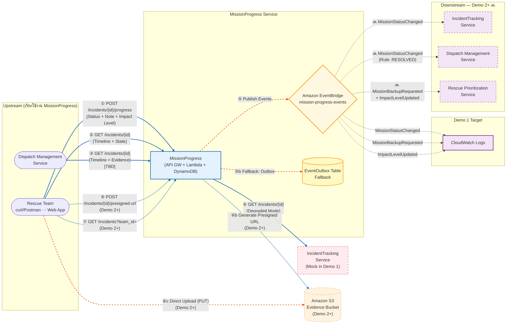

# Service Interaction Diagram



## **คำอธิบาย Flow**

| สัญลักษณ์           | ความหมาย                                               |
| ------------------- | ------------------------------------------------------ |
| **เส้นทึบ (═══)**   | Synchronous — รอผลตอบกลับทันที (HTTP Request/Response) |
| **เส้นประ (- - -)** | Asynchronous — ส่งแล้วไม่รอผล (Event ผ่าน EventBridge) |

---

# Upstream Services (บริการที่เรียกใช้งาน MissionProgress)

---

## ① POST /incidents/{incident_id}/progress — Rescue Team

| รายละเอียด  | ค่า                                       |
| :---------- | :---------------------------------------- |
| **Purpose** | รายงานสถานะล่าสุดจากหน้างาน               |
| **Method**  | `POST`                                    |
| **Auth**    | `x-api-key` + `X-Rescue-Team-ID`          |
| **Lambda**  | `report-progress` (Go)                    |
| **Client**  | curl/Postman (Demo 1) → Web App (Demo 2+) |
| **Demo 1**  | ✅ Implemented                            |

#### Request Body

```json
{
  "new_status": "ON_SITE",
  "note": "ถึงจุดเกิดเหตุแล้ว น้ำสูง 1.2m",
  "new_impact_level": "HIGH" // optional
}
```

#### Response `200`

```json
{
  "message": "Progress reported successfully",
  "mission_id": "MSN-001",
  "incident_id": "INC-001",
  "old_status": "EN_ROUTE",
  "new_status": "ON_SITE",
  "updated_at": "2025-..."
}
```

---

## ② GET /incidents/{incident_id} — Rescue Team

| รายละเอียด  | ค่า                              |
| :---------- | :------------------------------- |
| **Purpose** | ดึง Timeline + สถานะปัจจุบัน     |
| **Method**  | `GET`                            |
| **Auth**    | `x-api-key` + `X-Rescue-Team-ID` |
| **Lambda**  | `get-mission` (Go)               |
| **Demo 1**  | ✅ Implemented                   |

#### Response `200`

```json
{
  "incident_id": "INC-001",
  "mission_id": "MSN-001",
  "rescue_team_id": "TEAM-ALPHA",
  "current_status": "ON_SITE",
  "latest_impact_level": 3,
  "started_at": "2024-12-01T08:00:00Z",
  "last_updated_at": "2025-06-14T09:32:15Z",
  "timeline": [ ... ],
  "data_source": "partial"
}
```

> - `data_source: "full"` — เรียก IncidentTracking สำเร็จ (มี description, location, incident_type)
> - `data_source: "partial"` — เรียกไม่สำเร็จ (Degraded Mode — Demo 1 เป็น partial เสมอ)

---

## ③ GET /incidents/{incident_id} — Dispatch Management Service

| รายละเอียด  | ค่า                                            |
| :---------- | :--------------------------------------------- |
| **Purpose** | Dispatcher ดู Timeline ละเอียด + รูปภาพหลักฐาน |
| **Method**  | `GET` (ใช้ endpoint เดียวกับ ②)                |
| **Status**  | \[TBD: Pending Discussion กับ Noppakron]       |

#### ทำไม Dispatch อาจต้องเรียก GET API (ไม่ใช่แค่ฟัง Event)

| ข้อมูลที่ Dispatcher ต้องการ |         ได้จาก Event?          | ได้จาก GET API? |
| :--------------------------- | :----------------------------: | :-------------: |
| สถานะปัจจุบัน                |               ✅               |       ✅        |
| Timeline ทั้งหมดย้อนหลัง     | ❌ (Event ส่งแค่ entry ล่าสุด) |       ✅        |
| รูปภาพหลักฐาน (Demo 2+)      |               ❌               |       ✅        |

---

## ⑥ POST /incidents/{incident_id}/presigned-url — Rescue Team (Demo 2+)

| รายละเอียด  | ค่า                                      |
| :---------- | :--------------------------------------- |
| **Purpose** | ขอ Presigned URL สำหรับอัปโหลดรูปหลักฐาน |
| **Method**  | `POST`                                   |
| **Auth**    | `x-api-key` + `X-Rescue-Team-ID`         |
| **Lambda**  | `presigned-url` (Go)                     |
| **Demo 1**  | ❌ ยังไม่ implement                      |
| **Demo 2+** | 🔜 Planned                               |

#### Request Body

```json
{
  "file_name": "flood-evidence-001.jpg",
  "content_type": "image/jpeg"
}
```

#### Response `200`

```json
{
  "upload_url": "https://s3.amazonaws.com/...",
  "image_key": "evidence/INC-001/TEAM-ALPHA/1718352735-flood-evidence-001.jpg",
  "expires_in": 300,
  "message": "Presigned URL generated successfully"
}
```

#### Full Upload Flow

```
⑥a.  Frontend  →  POST /incidents/{id}/presigned-url  →  Lambda
⑥b.  Lambda    →  S3 (Generate Presigned URL)          →  Return URL + image_key
⑥c.  Frontend  →  S3 (Direct PUT Upload ด้วย Presigned URL)
⑥d.  Frontend  →  POST /incidents/{id}/progress (แนบ image_key)  →  เชื่อม Evidence กับ Timeline entry
```

---

## ⑦ GET /incidents?team_id={team_id} — Rescue Team (Demo 2+)

| รายละเอียด  | ค่า                              |
| :---------- | :------------------------------- |
| **Purpose** | ดึงรายการภารกิจทั้งหมดของทีม     |
| **Method**  | `GET`                            |
| **Auth**    | `x-api-key` + `X-Rescue-Team-ID` |
| **Lambda**  | `list-missions` (Go)             |
| **Demo 1**  | ❌ ยังไม่ implement              |
| **Demo 2+** | 🔜 Planned                       |

#### Query Parameters

| Parameter | Required | Description                        |
| :-------- | :------: | :--------------------------------- |
| `team_id` |    ✅    | รหัสทีมกู้ภัย เช่น `TEAM-ALPHA`    |
| `status`  |    ❌    | กรอง เช่น `ON_SITE`, `NEED_BACKUP` |

#### Response `200`

```json
{
  "team_id": "TEAM-ALPHA",
  "total_missions": 3,
  "missions": [
    {
      "mission_id": "MSN-001",
      "incident_id": "INC-001",
      "current_status": "ON_SITE",
      "latest_impact_level": 3,
      "started_at": "2024-12-01T08:00:00Z",
      "last_updated_at": "2025-06-14T09:32:15Z"
    },
    ...
  ]
}
```

---

## ⑧ MissionAssignedEvent — จาก Dispatch (Inbound Async, Demo 2+)

| รายละเอียด  | ค่า                                                        |
| :---------- | :--------------------------------------------------------- |
| **Source**  | Dispatch Management Service                                |
| **Trigger** | เมื่อ Dispatcher มอบหมายภารกิจให้ทีมกู้ภัย                 |
| **Channel** | EventBridge                                                |
| **Status**  | \[TBD: Pending Discussion กับ Noppakron]                   |
| **Demo 1**  | ❌ ใช้ Seed Data แทน (`script/seed-data.sh`)               |
| **Demo 2+** | 🔜 รับ Event จาก Dispatch → สร้าง Mission Record อัตโนมัติ |

#### Expected Payload

```json
{
  "source": "dispatch-management-service",
  "detail-type": "MissionAssignedEvent",
  "detail": {
    "mission_id": "MSN-001",
    "rescue_unit_id": "TEAM-ALPHA",
    "incident_id": "INC-001",
    "incident_type": "FLOOD",
    "incident_description": "น้ำท่วมหนัก บ้าน 2 ชั้น",
    "incident_location": "13.7563,100.5018",
    "impact_level": "MODERATE",
    "priority": "MEDIUM",
    "assigned_at": "2025-06-14T08:45:00Z"
  }
}
```

#### MissionProgress จะทำอะไร

1. สร้าง MissionAssignment record (status = `DISPATCHED`)
2. สร้าง MissionTimeline entry แรก
3. เก็บ incident data เป็น Reference Copy

---

---

# Downstream Services (บริการปลายทางที่ MissionProgress เรียกหรือส่งข้อมูลไป)

MissionProgress สื่อสารกับ Downstream ผ่าน **2 ช่องทาง**:

- **Synchronous (HTTP)** — เรียกดึงข้อมูลแบบรอผลตอบกลับ
- **Asynchronous (EventBridge Events)** — ส่ง Event แล้วไม่รอผล

---

## 1. IncidentTracking Service

> **Owner:** Krittamet Damthongkam
> **บทบาท:** เป็น Source of Truth ของข้อมูลเหตุการณ์ (Incident Master Data)

#### การสื่อสาร

|  #  | ช่องทาง                      | ทิศทาง                             | รายละเอียด                                                                                      | Demo 1                             | Demo 2+                  |
| :-: | :--------------------------- | :--------------------------------- | :---------------------------------------------------------------------------------------------- | :--------------------------------- | :----------------------- |
|  ④  | Sync `GET /incidents/{id}`   | MissionProgress → IncidentTracking | ดึง description, location, incident_type (ถ้าล้มเหลว → Degraded Mode, `data_source: "partial"`) | ⚠️ Mock (localhost:9999 → timeout) | ✅ URL จริง \[TBD]       |
| ⑤a  | Async `MissionStatusChanged` | MissionProgress → IncidentTracking | อัปเดตสถานะรวมของ Incident (เช่น "In Progress")                                                 | → CloudWatch Logs                  | 🔜 → Service จริง \[TBD] |
| ⑤b  | Async `ImpactLevelUpdated`   | MissionProgress → IncidentTracking | ส่ง Impact Level ล่าสุด → IncidentTracking อัปเดต Master Data                                   | → CloudWatch Logs                  | 🔜 → Service จริง \[TBD] |

#### Expected API Response (Sync GET)

```json
{
  "incident_id": "INC-001",
  "description": "น้ำท่วมหนักบริเวณถนนพหลโยธิน",
  "location": "13.7563,100.5018",
  "incident_type": "FLOOD"
}
```

#### Failure Handling

| กรณี                                        | การจัดการ                                                                     |
| :------------------------------------------ | :---------------------------------------------------------------------------- |
| Sync GET ล้มเหลว (timeout 3 วินาที / error) | **Degraded Mode** — ส่งเฉพาะข้อมูลที่มี → ทีมกู้ภัยยังทำงานได้ปกติ            |
| Async Event Publish ล้มเหลว                 | **Outbox Pattern** → บันทึกลง EventOutbox → (Demo 2+) retry processor ส่งใหม่ |

---

## 2. Dispatch Management Service

> **Owner:** Noppakron Songkroh
> **บทบาท:** จัดการการมอบหมายงานและสถานะทีมกู้ภัย (BUSY/AVAILABLE)

#### การสื่อสาร

|  #  | ช่องทาง                                       | ทิศทาง                     | รายละเอียด                                               | Demo 1            | Demo 2+                  |
| :-: | :-------------------------------------------- | :------------------------- | :------------------------------------------------------- | :---------------- | :----------------------- |
| ⑤b  | Async `MissionStatusChanged` (Rule: RESOLVED) | MissionProgress → Dispatch | แจ้งว่าภารกิจเสร็จ → ปลดล็อกทีมกู้ภัย (BUSY → AVAILABLE) | → CloudWatch Logs | 🔜 → Service จริง \[TBD] |

#### EventBridge Rule Filter

```json
{
  "source": ["mission-progress-service"],
  "detail-type": ["MissionStatusChanged"],
  "detail": {
    "new_status": ["RESOLVED"]
  }
}
```

> _หมายเหตุ: Dispatch ยังเป็น Upstream ด้วย — ส่ง MissionAssignedEvent เข้ามา (⑧) + อาจเรียก GET API (③)_

#### Failure Handling

| กรณี                                  | การจัดการ                                             |
| :------------------------------------ | :---------------------------------------------------- |
| EventBridge Publish ล้มเหลว           | Outbox Pattern → EventOutbox table → retry ใน Demo 2+ |
| EventBridge → Dispatch Target ล้มเหลว | EventBridge built-in retry (24 ชั่วโมง)               |

---

## 3. Rescue Prioritization Service

> **Owner:** Nattasak Chonmanat
> **บทบาท:** จัดลำดับความสำคัญและความเร่งด่วนของแต่ละเคส (Priority Score)

#### การสื่อสาร

|  #  | ช่องทาง                        | ทิศทาง                           | รายละเอียด                                                           | Demo 1            | Demo 2+                  |
| :-: | :----------------------------- | :------------------------------- | :------------------------------------------------------------------- | :---------------- | :----------------------- |
| ⑤c  | Async `MissionBackupRequested` | MissionProgress → Prioritization | ทีมกู้ภัยต้องการกำลังเสริม (NEED_BACKUP) → คำนวณ Priority Score ใหม่ | → CloudWatch Logs | 🔜 → Service จริง \[TBD] |
| ⑤d  | Async `ImpactLevelUpdated`     | MissionProgress → Prioritization | ส่ง Impact Level ล่าสุด → คำนวณลำดับความสำคัญใหม่                    | → CloudWatch Logs | 🔜 → Service จริง \[TBD] |

#### Failure Handling

| กรณี                           | การจัดการ                                                          |
| :----------------------------- | :----------------------------------------------------------------- |
| EventBridge Publish ล้มเหลว    | **Outbox Pattern** (safety net สำหรับ retry)                       |
| Event ส่งไม่ถึง Prioritization | **Non-blocking** — ระบบกู้ภัยยังทำงานต่อได้ (ไม่ใช่ Critical Path) |

---

## 4. Amazon S3 — Evidence Bucket (Demo 2+)

> **บทบาท:** เก็บรูปภาพหลักฐานจากหน้างาน

#### การสื่อสาร

|  #  | ช่องทาง                     | ทิศทาง                    | รายละเอียด                                                      | Demo 1 | Demo 2+ |
| :-: | :-------------------------- | :------------------------ | :-------------------------------------------------------------- | :----: | :-----: |
| ⑥b  | Sync Generate Presigned URL | presigned-url Lambda → S3 | สร้าง Presigned URL (PUT) อายุ 5 นาที                           |   ❌   |   🔜    |
| ⑥c  | Frontend → S3 Direct        | Rescue Team → S3          | อัปโหลดรูปตรงไป S3 ด้วย Presigned URL (ไม่ผ่าน MissionProgress) |   ❌   |   🔜    |

#### Failure Handling

| กรณี                             | การจัดการ                                        |
| :------------------------------- | :----------------------------------------------- |
| Presigned URL Generation ล้มเหลว | Lambda return 500 → **ให้ผู้ใช้ retry**          |
| Upload ไป S3 ล้มเหลว             | อนุญาตให้ "ข้าม" → ส่งเฉพาะ **Text Status** ก่อน |

---

---

# EventBridge Events — Routing Detail

## ⑤ Lambda → EventBridge (mission-progress-events)

`report-progress` Lambda publish events เมื่อ POST สำเร็จ:

| Event                    | Trigger                     | Payload สำคัญ                                                                                   |
| :----------------------- | :-------------------------- | :---------------------------------------------------------------------------------------------- |
| `MissionStatusChanged`   | ทุกครั้งที่สถานะเปลี่ยน     | mission_id, incident_id, rescue_team_id, old_status, new_status, note, updated_at, performed_by |
| `MissionBackupRequested` | new_status = `NEED_BACKUP`  | (เหมือน MissionStatusChanged)                                                                   |
| `ImpactLevelUpdated`     | มี new_impact_level ใน body | mission_id, incident_id, rescue_team_id, new_impact_level, note, updated_at                     |

#### EventBridge Event Payload ตัวอย่าง

**MissionStatusChanged**

```json
{
  "source": "mission-progress-service",
  "detail-type": "MissionStatusChanged",
  "detail": {
    "mission_id": "MSN-001",
    "incident_id": "INC-001",
    "rescue_team_id": "TEAM-ALPHA",
    "old_status": "EN_ROUTE",
    "new_status": "ON_SITE",
    "note": "ถึงจุดเกิดเหตุแล้ว",
    "updated_at": "2025-06-14T09:32:15Z",
    "performed_by": "TEAM-ALPHA"
  }
}
```

**ImpactLevelUpdated**

```json
{
  "source": "mission-progress-service",
  "detail-type": "ImpactLevelUpdated",
  "detail": {
    "mission_id": "MSN-001",
    "incident_id": "INC-001",
    "rescue_team_id": "TEAM-ALPHA",
    "new_impact_level": "HIGH",
    "note": "น้ำเพิ่มระดับเร็วกว่าที่ประเมิน",
    "updated_at": "2025-06-14T09:35:00Z"
  }
}
```

---

## Routing — Demo 1 vs Demo 2+

### Demo 1 (ปัจจุบัน): 3 EventBridge Rules → CloudWatch Logs

| Rule                          | Pattern                               | Target               |
| :---------------------------- | :------------------------------------ | :------------------- |
| `mission-status-changed-rule` | detail-type: `MissionStatusChanged`   | CloudWatch Log Group |
| `backup-requested-rule`       | detail-type: `MissionBackupRequested` | CloudWatch Log Group |
| `impact-level-updated-rule`   | detail-type: `ImpactLevelUpdated`     | CloudWatch Log Group |

### Demo 2+ (แผน): เพิ่ม Rules → Route ไป Service จริง

| Event                    | Subscriber            | EventBridge Rule Filter                                             | Target                            |
| :----------------------- | :-------------------- | :------------------------------------------------------------------ | :-------------------------------- |
| `MissionStatusChanged`   | IncidentTracking      | detail-type: `MissionStatusChanged`                                 | Lambda / SQS ของ IncidentTracking |
| `MissionStatusChanged`   | Dispatch Mgmt         | detail-type: `MissionStatusChanged` + detail.new_status: `RESOLVED` | Lambda / SQS ของ Dispatch         |
| `MissionBackupRequested` | Rescue Prioritization | detail-type: `MissionBackupRequested`                               | Lambda / SQS ของ Prioritization   |
| `ImpactLevelUpdated`     | IncidentTracking      | detail-type: `ImpactLevelUpdated`                                   | Lambda / SQS ของ IncidentTracking |
| `ImpactLevelUpdated`     | Rescue Prioritization | detail-type: `ImpactLevelUpdated`                                   | Lambda / SQS ของ Prioritization   |

---

## ⑤b Fallback: Outbox Pattern

```
EventBridge Publish ล้มเหลว
        │
        ▼
บันทึกลง EventOutbox Table (DynamoDB)
{
  "outbox_id": "OBX-uuid",
  "event_type": "MissionStatusChanged",
  "event_payload": "{...}",
  "status": "PENDING",
  "retry_count": 0,
  "ttl": <7 days>
}
```

| Phase       | พฤติกรรม                                                                      |
| :---------- | :---------------------------------------------------------------------------- |
| **Demo 1**  | Records สะสมไว้ (ยังไม่มี processor)                                          |
| **Demo 2+** | `outbox-processor` Lambda (ทุก 1 นาที) → Scan PENDING → Retry → SENT / FAILED |

> _สำคัญ: POST request ไม่ fail เพราะ EventBridge ล้มเหลว — ข้อมูลสถานะถูกบันทึกใน DynamoDB แล้ว_

---

---

# สรุป Interaction ทั้งหมด

## Inbound (เข้า MissionProgress)

|  #  | Source        | ช่องทาง     | Endpoint / Event                     | Demo 1          | Demo 2+    |
| :-: | :------------ | :---------- | :----------------------------------- | :-------------- | :--------- |
|  ①  | Rescue Team   | Sync POST   | `POST /incidents/{id}/progress`      | ✅ curl/Postman | ✅ Web App |
|  ②  | Rescue Team   | Sync GET    | `GET /incidents/{id}`                | ✅              | ✅         |
|  ③  | Dispatch Mgmt | Sync GET    | `GET /incidents/{id}`                | \[TBD]          | \[TBD]     |
|  ⑥  | Rescue Team   | Sync POST   | `POST /incidents/{id}/presigned-url` | ❌              | 🔜         |
|  ⑦  | Rescue Team   | Sync GET    | `GET /incidents?team_id={id}`        | ❌              | 🔜         |
|  ⑧  | Dispatch Mgmt | Async Event | `MissionAssignedEvent`               | ❌ Seed Data    | 🔜 \[TBD]  |

## Downstream / Outbound (ออกจาก MissionProgress)

|  #  | Destination           | ช่องทาง     | Event / API                                     | Demo 1    | Demo 2+           |
| :-: | :-------------------- | :---------- | :---------------------------------------------- | :-------- | :---------------- |
|  ④  | IncidentTracking      | Sync GET    | `GET /incidents/{id}` (Degraded Mode)           | ⚠️ Mock   | ✅ URL จริง       |
| ⑥b  | Amazon S3             | Sync        | Generate Presigned URL                          | ❌        | 🔜                |
| ⑤a  | IncidentTracking      | Async Event | `MissionStatusChanged` + `ImpactLevelUpdated`   | → CW Logs | 🔜 → Service จริง |
| ⑤b  | Dispatch Mgmt         | Async Event | `MissionStatusChanged` (Rule: RESOLVED)         | → CW Logs | 🔜 → Service จริง |
| ⑤c  | Rescue Prioritization | Async Event | `MissionBackupRequested` + `ImpactLevelUpdated` | → CW Logs | 🔜 → Service จริง |

## Frontend → S3 Direct (ไม่ผ่าน MissionProgress)

|  #  | Source                 | Destination | ช่องทาง                  | Demo 1 | Demo 2+ |
| :-: | :--------------------- | :---------- | :----------------------- | :----: | :-----: |
| ⑥c  | Rescue Team (Frontend) | Amazon S3   | HTTP PUT (Presigned URL) |   ❌   |   🔜    |

---

## Downstream Services สรุป (≥2 services ของเพื่อนร่วมชั้น ✅)

|  #  | Service                       | Owner                 | ช่องทาง                | Interaction                                                     |
| :-: | :---------------------------- | :-------------------- | :--------------------- | :-------------------------------------------------------------- |
|  1  | IncidentTracking Service      | Krittamet Damthongkam | HTTP GET + EventBridge | Sync (ดึงข้อมูล) + Async (2 Events)                             |
|  2  | Dispatch Management Service   | Noppakron Songkroh    | EventBridge + HTTP GET | Async (RESOLVED Event) + Sync GET \[TBD] + Inbound Event \[TBD] |
|  3  | Rescue Prioritization Service | Nattasak Chonmanat    | EventBridge            | Async (2 Events)                                                |

---

## Failure Handling

| กรณี                        | การจัดการ                                | Demo 1                | Demo 2+         |
| :-------------------------- | :--------------------------------------- | :-------------------- | :-------------- |
| IncidentTracking ล่ม        | Degraded Mode (`data_source: "partial"`) | ✅ เป็น Degraded เสมอ | ✅              |
| EventBridge Publish ล้มเหลว | Outbox Pattern → EventOutbox table       | ✅ save only          | ✅ save + retry |
| Lambda Authorizer ล่ม       | HTTP 500                                 | ✅                    | ✅              |
| S3 Presigned URL ล้มเหลว    | Lambda return 500 → User Retry           | —                     | 🔜              |
| S3 Upload ล้มเหลว           | อนุญาตให้ "ข้าม" → ส่งแค่ Text Status    | —                     | 🔜              |
